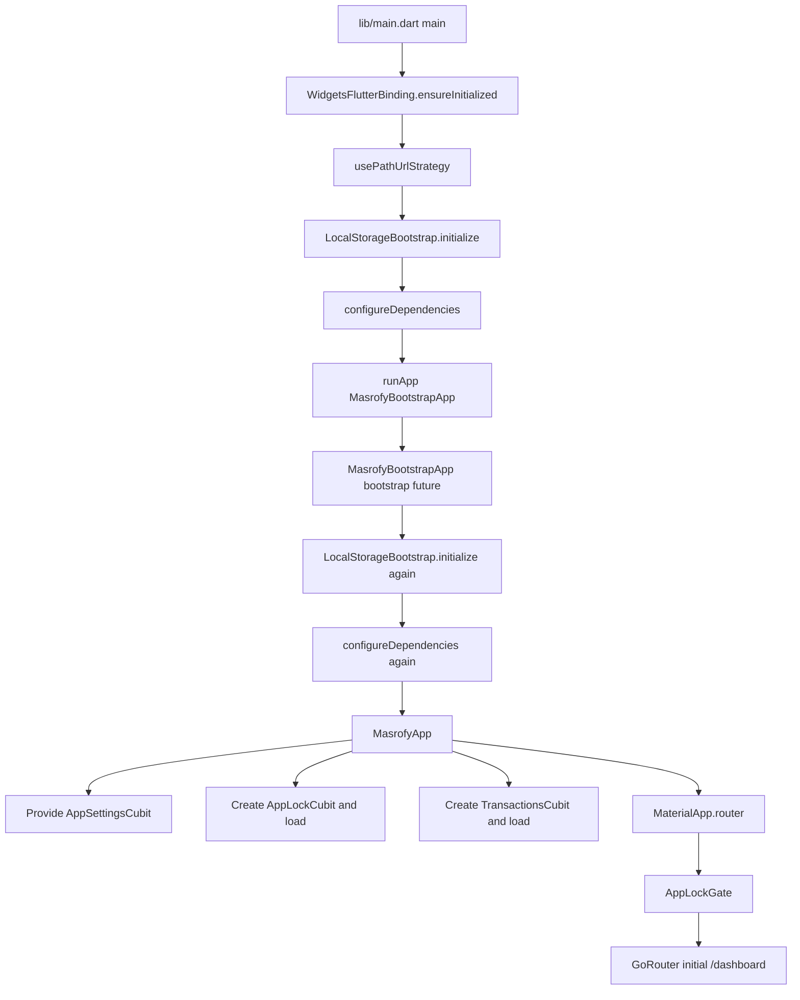
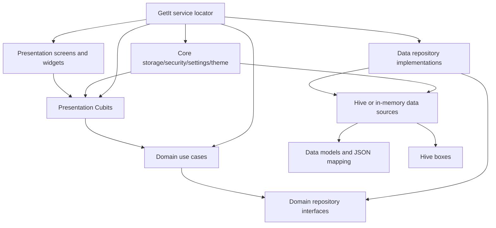
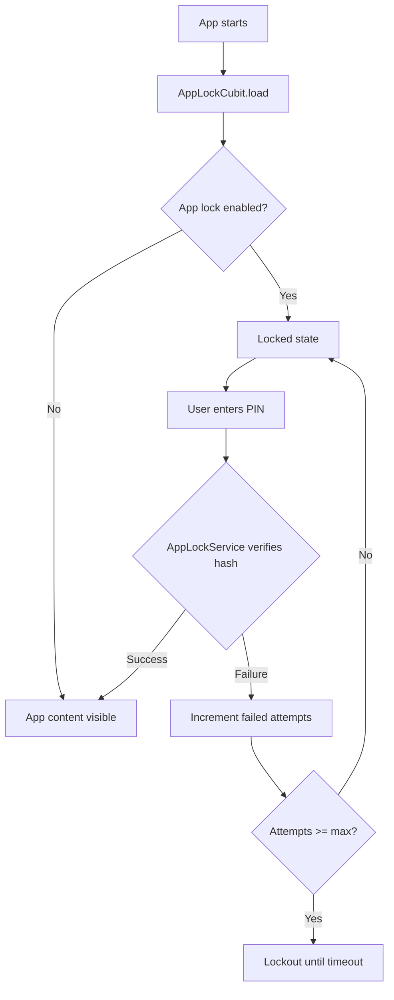
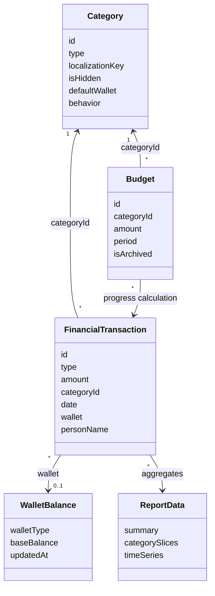

# Flutter Mobile App - Complete Project Analysis

## 1. Executive Summary

Masrofy is a Flutter expense-tracking application focused on local personal finance management. Repository evidence shows features for transactions, categories, budgets, reports, wallet balances, backup/restore, export, privacy masking, and a local PIN-based app lock. The product appears targeted at Arabic and English users, with Arabic as the default locale and Egyptian currency formatting.

The app uses a layered architecture:

- `lib/presentation/` for screens, widgets, and Cubits.
- `lib/domain/` for entities, repository contracts, and use cases.
- `lib/data/` for Hive-backed data sources, models, repositories, backup, and export.
- `lib/core/` for storage, security, theme, settings, and formatting utilities.
- `lib/di/service_locator.dart` for GetIt service registration.
- `lib/routing/app_router.dart` for GoRouter routes.

Main technologies include Flutter Material 3, `flutter_bloc` Cubits, `get_it`, `go_router`, Hive with local encryption for current data boxes, `flutter_secure_storage`, `freezed`, `json_serializable`, `fl_chart`, `pdf`, `printing`, and `excel`.

Implementation maturity is high for an offline/local-first application. The repository has broad unit and widget test coverage, strict analyzer settings, and validation commands completed successfully:

- `flutter analyze`: no issues found.
- `flutter test`: 111 tests passed.

Strongest areas:

- Clear separation between presentation, domain, data, storage, and DI.
- Broad test coverage across storage migrations, app lock, backup/restore, exports, use cases, Cubits, and screens.
- Local data migration and quarantine mechanisms exist.
- Backup restore includes validation and rollback behavior.
- Arabic/English localization is wired through Flutter l10n.

Most serious risks:

- The startup path initializes storage and dependencies before `runApp`, then the bootstrap widget can run the same initialization again.
- Storage quarantine records can contain raw financial record values, while the quarantine box is opened without Hive encryption.
- Native release identifiers and web manifest metadata still contain Flutter template values such as `com.example.masrofy` and "A new Flutter project."
- Web readiness is doubtful because user-facing settings/export code imports `dart:io`.
- The app-lock biometric setting is stored, but no biometric plugin or biometric authentication flow was detected.

It is safe to continue feature development with precautions. Before large new features, stabilize startup idempotency, security around quarantine storage, release identifiers, and target-platform expectations. Production readiness requires external verification of signing, store metadata, app identifiers, platform behavior, and privacy/security requirements.

## 2. Analysis Scope and Method

Statically inspected the repository from:

`F:\Projects\Flutter Projects\Random Apps\masrofy`

Primary files inspected include:

- `README.md`
- `rules.md`
- `pubspec.yaml`
- `pubspec.lock`
- `analysis_options.yaml`
- `l10n.yaml`
- `lib/main.dart`
- `lib/app/masrofy_bootstrap_app.dart`
- `lib/app/masrofy_app.dart`
- `lib/routing/app_router.dart`
- `lib/di/service_locator.dart`
- `lib/core/storage/local_storage_bootstrap.dart`
- `lib/core/storage/storage_schema.dart`
- `lib/core/storage/migrations/storage_migration_manager.dart`
- `lib/core/security/app_lock_service.dart`
- `lib/core/security/secure_value_store.dart`
- Major files under `lib/data/`, `lib/domain/`, and `lib/presentation/`
- Platform configuration under `android/`, `ios/`, `macos/`, `windows/`, `linux/`, and `web/`
- Test inventory under `test/`

Generated and cache directories such as `.dart_tool/`, `build/`, `coverage/`, generated l10n files, generated Freezed/JSON files, and platform build artifacts were ignored except where they were needed to understand configuration.

Validation commands executed:

| Command | Result | Notes |
| --- | --- | --- |
| `git status --short` | Completed | Baseline showed pre-existing deleted Markdown/prompt files. |
| `flutter --version` | Completed | Flutter `3.42.0-0.4.pre`, beta channel. |
| `dart --version` | Completed | Dart `3.12.0-113.2.beta`. |
| `flutter pub get` | Completed | Dependencies resolved; 19 newer versions are incompatible with current constraints. |
| `flutter analyze` | Passed | No issues found; reported runtime was 52.0s. |
| `flutter test` | Passed | 111 tests passed. PDF export tests warned about unavailable Google Fonts download and Helvetica fallback. |

No application source code, dependency version, generated file, native release configuration, or app behavior was intentionally modified. This report is the only intended repository change.

## 3. Repository Status During Analysis

Git was available.

| Item | Value |
| --- | --- |
| Branch | `main` |
| Commit | `33c75c1b564fdee96155f68634dd0ff6847e867c` |
| Working tree before analysis | Not clean |

Pre-existing status before this report was recreated:

```text
 D FLUTTER_PROJECT_ANALYSIS.md
 D MASROFY_UI_UX_IMPLEMENTATION_REPORT.md
 D codex_flutter_full_review_prompt.md
 D codex_ui_ux_deep_enhancement_prompt.md
```

The deleted Markdown/prompt files appeared before any file edit in this analysis. They were not reverted or modified.

Analysis commands did not intentionally change app source. `flutter pub get` completed successfully. No dependency files were intentionally edited.

Final Git status observed after report creation:

```text
 M FLUTTER_PROJECT_ANALYSIS.md
 D MASROFY_UI_UX_IMPLEMENTATION_REPORT.md
 D codex_flutter_full_review_prompt.md
 D codex_ui_ux_deep_enhancement_prompt.md
?? assets/images/logos/logo1.jpg
?? assets/images/logos/logo2.png
```

`FLUTTER_PROJECT_ANALYSIS.md` is the intended documentation change. The deleted Markdown/prompt files were present before analysis. The untracked logo files appeared during the analysis window; they are not referenced by app code and are not declared in `pubspec.yaml` from the static checks performed. Their origin is unable to verify from repository code alone.

## 4. Application Overview

Confirmed application identity:

| Item | Evidence |
| --- | --- |
| Flutter package name | `name: masrofy` in `pubspec.yaml` |
| Description | `Masrofy expense tracking app.` in `pubspec.yaml` |
| Android app label | `masrofy` in `android/app/src/main/AndroidManifest.xml` |
| iOS display name | `Masrofy` in `ios/Runner/Info.plist` |
| macOS product name | `masrofy` in `macos/Runner/Configs/AppInfo.xcconfig` |
| Web app name | `masrofy` in `web/manifest.json` |

Confirmed product purpose:

Masrofy is an offline/local expense tracking app. It supports income and expense transactions, categories, reports, monthly budgets, tracked wallet balances, backups, exports, app lock, and privacy masking.

Target users:

- Confirmed: Arabic and English users, based on `lib/l10n/app_ar.arb`, `lib/l10n/app_en.arb`, l10n setup, and Arabic default locale in `AppSettingsStore`.
- Reasonable inference: Egyptian personal finance users, based on EGP/currency formatting and wallet types such as InstaPay and Vodafone Cash.

Core user-facing features:

- Dashboard summaries.
- Add/edit/delete transactions.
- Transaction history with filters.
- Category management.
- Monthly budgets.
- Reports and charts.
- Excel/PDF export.
- Backup/restore.
- Wallet balance calibration.
- Theme and language settings.
- Hide/reveal financial amounts.
- Local PIN app lock.

Premium, restricted, administrative, payment, and internal roles:

Not detected in the current repository.

Current development status:

Mostly complete as a local-first Flutter app from static inspection and passing tests. Release readiness still requires external and runtime verification.

## 5. Supported Platforms and Build Targets

Repository platform folders:

| Platform | Folder | Status from repository |
| --- | --- | --- |
| Android | `android/` | Present and configured. |
| iOS | `ios/` | Present and configured. |
| Web | `web/` | Present, but runtime/build readiness is questionable due `dart:io` use in app code. |
| macOS | `macos/` | Present. |
| Windows | `windows/` | Present. |
| Linux | `linux/` | Present. |

SDK constraints:

- Dart SDK constraint in `pubspec.yaml`: `^3.12.0-113.2.beta`
- Flutter version observed from `flutter --version`: `3.42.0-0.4.pre`
- `pubspec.lock` indicates Flutter SDK `>=3.38.4` and Dart `>=3.12.0-113.2.beta <4.0.0`.

Build flavors:

No custom Flutter flavors or `lib/main_*.dart` entry points were detected. The only app entry point found is `lib/main.dart`.

Platform confidence:

- Android/iOS/mobile: high static confidence for core local app behavior.
- Desktop: moderate static confidence; file IO and path provider are used, but desktop runtime was not executed.
- Web: requires runtime/build verification because `lib/presentation/screens/settings/settings_screen.dart` and export paths use `dart:io`, which is incompatible with Flutter web unless conditionally isolated.

## 6. Technology Stack

| Area | Packages / Files | Notes |
| --- | --- | --- |
| App framework | Flutter, Material 3 | `lib/core/theme/app_theme.dart` |
| State management | `flutter_bloc`, Cubit, local `StatefulWidget` state | Cubits under `lib/presentation/cubits/` |
| Routing | `go_router` | `lib/routing/app_router.dart` |
| Dependency injection | `get_it` | `lib/di/service_locator.dart` |
| Local storage | `hive`, `hive_flutter` | Data sources under `lib/data/datasources/` |
| Secure storage | `flutter_secure_storage` | `lib/core/security/secure_value_store.dart` |
| Serialization | `freezed`, `json_serializable`, manual JSON parsing | Models under `lib/data/models/` |
| Localization | `flutter_localizations`, `intl`, Flutter l10n | `l10n.yaml`, `lib/l10n/` |
| Charts | `fl_chart` | Reports screens/widgets |
| Export | `excel`, `pdf`, `printing`, `path_provider` | `lib/data/export/` |
| Security/hash | `crypto` | `AppLockService` |
| IDs | `uuid` | Category/transaction/budget creation |
| Testing | `flutter_test`, `mockito`, `bloc_test`, `checks`, `coverage`, `integration_test` dev dependency | Tests under `test/`; no `integration_test/` folder detected |

Networking clients, Firebase SDKs, analytics SDKs, payment SDKs, ads SDKs, maps SDKs, and remote backend packages were not detected in app dependencies.

## 7. Project Structure

Important directory map:

```text
lib/
|-- app/                       # Bootstrap widget and root MaterialApp.router
|-- core/
|   |-- export/                 # Local export writer and file naming helpers
|   |-- security/               # App lock service, secure value storage
|   |-- settings/               # App settings persistence
|   |-- storage/                # Hive bootstrap, schema, migrations, quarantine
|   |-- theme/                  # Material theme and design tokens
|-- data/
|   |-- backup/                 # Backup/restore service
|   |-- catalog/                # Default category catalog
|   |-- datasources/            # Hive/in-memory data sources
|   |-- export/                 # Excel/PDF exporters and data export service
|   |-- models/                 # Persistence/serialization models
|   |-- repositories/           # Repository implementations
|-- di/                         # GetIt registration
|-- domain/
|   |-- entities/               # Business entities and enums
|   |-- repositories/           # Repository interfaces
|   |-- usecases/               # Business actions and aggregations
|-- l10n/                       # ARB localization and generated output
|-- presentation/
|   |-- cubits/                 # Feature Cubits and state classes
|   |-- models/                 # UI helper models
|   |-- screens/                # Dashboard, history, reports, budgets, settings
|   |-- security/               # App lock gate and screens
|   |-- shell/                  # Main navigation shell
|   |-- widgets/                # Shared/reusable widgets
|-- routing/                    # GoRouter definitions
|-- main.dart                   # Primary entry point
```

Project-level folders:

```text
android/       # Android Gradle project and manifests
ios/           # iOS Runner project
macos/         # macOS Runner project
windows/       # Windows Runner project
linux/         # Linux Runner project
web/           # Flutter web manifest and icons
test/          # Unit and widget tests
coverage/      # Generated coverage output, ignored for implementation analysis
build/         # Generated build output, ignored
.dart_tool/    # Flutter/Dart generated metadata, ignored
```

No `lib/features/`, `lib/services/`, `lib/providers/`, or `lib/blocs/` directories were detected. The app is layer-first rather than feature-first.

## 8. Application Startup and Initialization Flow

Primary entry point: `lib/main.dart`

Confirmed order in `main()`:

1. `WidgetsFlutterBinding.ensureInitialized()`
2. `usePathUrlStrategy()`
3. `await LocalStorageBootstrap.initialize()`
4. `await configureDependencies()`
5. `runApp(const MasrofyBootstrapApp())`

Root bootstrap widget: `MasrofyBootstrapApp` in `lib/app/masrofy_bootstrap_app.dart`

Confirmed bootstrap behavior:

- `MasrofyBootstrapApp` owns a `_bootstrapFuture`.
- Its default bootstrap callback again calls `LocalStorageBootstrap.initialize()` and `configureDependencies()`.
- A temporary `MaterialApp` shows a startup loading screen while the future runs.
- Startup failure shows `StartupFailureScreen` with retry.
- Success renders `MasrofyApp`.

Root app widget: `MasrofyApp` in `lib/app/masrofy_app.dart`

Confirmed root app behavior:

- Reads `GoRouter` from `serviceLocator`.
- Provides `AppSettingsCubit` as a singleton value.
- Creates and loads `AppLockCubit`.
- Creates and loads global `TransactionsCubit`.
- Builds `MaterialApp.router`.
- Wraps app content with `AppLockGate`.

Startup diagram:



Blocking startup operations:

- Hive initialization and box opening in `LocalStorageBootstrap.initialize()`.
- Secure storage access for the Hive encryption key.
- Storage migration via `StorageMigrationManager`.
- Dependency registration in `configureDependencies()`.
- Default category initialization via `InitializeDefaultCategories`.

Failure behavior:

- `LocalStorageBootstrap.initialize()` throws `StateError` if migration fails.
- `MasrofyBootstrapApp` can show `StartupFailureScreen` and retry.
- If the pre-`runApp` initialization in `main.dart` fails, `runApp` is never reached, so the startup failure UI will not appear for that first failure path.

Potential startup issue:

Duplicate initialization is confirmed by `lib/main.dart` and `MasrofyBootstrapApp`. `service_locator.dart` guards many registrations with helper methods that skip already-registered types, which reduces but does not eliminate the need for runtime verification around double Hive initialization, box opening, and async races.

Not detected:

- Firebase initialization.
- Environment file loading.
- Global `runZonedGuarded`.
- `FlutterError.onError`.
- `PlatformDispatcher.instance.onError`.
- Analytics setup.
- Remote configuration.
- Notification initialization.
- Orientation locking.

## 9. Architecture Analysis

The project uses a layered, Clean Architecture-inspired structure with BLoC/Cubit presentation state, use cases, repository interfaces, repository implementations, local data sources, and shared core infrastructure.

Confirmed dependency flow:



Architectural characteristics:

- Layer-first, not feature-first.
- Domain entities are separated from persistence models.
- Repository interfaces live in `lib/domain/repositories/`.
- Implementations live in `lib/data/repositories/`.
- Use cases live in `lib/domain/usecases/`.
- Cubits generally depend on use cases, not data sources.
- Some UI code reads use cases directly through `serviceLocator`, such as dashboard summary building.
- Local data sources have Hive-backed and in-memory variants.
- App settings and app lock are core services rather than feature modules.

Architecture inconsistencies:

- The presentation layer can access `serviceLocator` directly from widgets, for example dashboard summary computation.
- Some user-facing error messages are hardcoded in Cubits rather than routed through localization.
- There is a global service locator, which is pragmatic but can hide dependency chains.
- Startup initialization is split between `main.dart` and `MasrofyBootstrapApp`.

Overall architecture is strong for a local-first app, with targeted areas for cleanup rather than a need for wholesale restructuring.

## 10. Dependency Direction and Module Boundaries

Confirmed intended boundaries:

| Layer | Owns | Should depend on | Evidence |
| --- | --- | --- | --- |
| Presentation | Screens, widgets, Cubits, UI state | Domain use cases, l10n, theme, routing | `lib/presentation/`, `lib/app/` |
| Domain | Entities, repository contracts, use cases | Pure Dart and contracts | `lib/domain/` |
| Data | Models, data sources, repository implementations | Domain contracts/entities, Hive, export libs | `lib/data/` |
| Core | Cross-cutting storage, settings, security, theme | Platform libraries and package adapters | `lib/core/` |
| DI | Object graph | All layers | `lib/di/service_locator.dart` |
| Routing | Route table and shell | Presentation screens and DI for route Cubits | `lib/routing/app_router.dart` |

Confirmed module boundaries:

- `TransactionRepositoryImpl`, `CategoryRepositoryImpl`, `BudgetRepositoryImpl`, and `WalletBalanceRepositoryImpl` implement domain repository interfaces.
- Use cases such as `SaveTransaction`, `SaveBudget`, and `BuildReport` operate on domain entities and repository contracts.
- Hive-specific persistence is isolated under `lib/data/datasources/` and `lib/core/storage/`.

Boundary risks:

- Direct service locator usage in screens makes dependencies less explicit.
- UI and Cubits contain some business-facing validation/error text.
- `BackupRestoreService` spans multiple repositories and settings stores by design; future changes must trace all persistence flows.

## 11. Complete Feature Inventory

Feature matrix:

| Feature | Main Files | State Management | Data Source | Status | Notes |
| --- | --- | --- | --- | --- | --- |
| Dashboard | `lib/presentation/screens/dashboard/dashboard_screen.dart` | `TransactionsCubit`, direct `BuildDashboardSummary` use case | Local transactions/categories | Mostly complete | Summary and recent transactions are connected; runtime UI polish not verified on device. |
| Transactions | `lib/presentation/widgets/transactions/add_transaction_sheet.dart`, `lib/presentation/cubits/transactions/transactions_cubit.dart` | `TransactionsCubit`, local widget state | Hive transaction/category data sources | Mostly complete | Add/edit/delete and filters are covered by tests. |
| History | `lib/presentation/screens/history/history_screen.dart` | `TransactionsCubit` | Local transactions/categories | Mostly complete | Search/filter/grouping present. |
| Categories | `lib/presentation/screens/settings/categories/categories_screen.dart` | `CategoriesCubit` | Local category data source | Mostly complete | Default and custom categories, visibility, wallet defaults. |
| Budgets | `lib/presentation/screens/budgets/budgets_screen.dart` | `BudgetsCubit` | Local budgets/transactions/categories | Mostly complete | Monthly budget progress and validation present. |
| Reports | `lib/presentation/screens/reports/reports_screen.dart` | `ReportsCubit` | Local transactions/categories | Mostly complete | Charts, filters, PDF/Excel export connected. |
| Wallet Balances | `lib/presentation/screens/settings/wallet_balances_screen.dart` | `WalletBalancesCubit` | Local wallet balances/transactions | Mostly complete | Tracks InstaPay and Vodafone Cash; cash exists but is not a tracked balance. |
| Settings | `lib/presentation/screens/settings/settings_screen.dart` | `AppSettingsCubit`, `AppLockCubit`, local widget state | Settings store, backup/export services | Mostly complete | Mobile/web file import UX needs work. |
| App Lock | `lib/core/security/app_lock_service.dart`, `lib/presentation/security/app_lock_gate.dart` | `AppLockCubit` | Secure storage | Partially implemented | PIN flow exists; biometric flag exists but biometric auth not detected. |
| Backup/Restore | `lib/data/backup/backup_restore_service.dart` | Called from Settings UI | Local repositories/settings store | Mostly complete | Backup validation and rollback covered by tests; file picker not detected. |
| Export | `lib/data/export/` | Called from Reports/Settings UI | Local data | Mostly complete | Excel/PDF export present; PDF font download fallback needs runtime/offline verification. |
| Startup Failure | `lib/app/masrofy_bootstrap_app.dart` | Local bootstrap future | Storage/DI | Mostly complete | Handles bootstrap-widget failures, but pre-`runApp` failure cannot show UI. |

### Dashboard

**Purpose**

Show financial summaries for today, current week, current month, and recent transactions.

**User entry points**

Initial route `/dashboard` and first bottom navigation tab.

**Main screens**

`DashboardScreen` in `lib/presentation/screens/dashboard/dashboard_screen.dart`.

**Routes**

`AppRoutes.dashboard` mapped to `/dashboard`.

**State management**

Global `TransactionsCubit` provided by `MasrofyApp`. Dashboard also retrieves `BuildDashboardSummary` from `serviceLocator`.

**Services and repositories**

`BuildDashboardSummary`, transaction repository, category repository.

**Models**

`DashboardSummary`, `FinancialTransaction`, `Category`.

**Remote data sources**

Not detected in the current repository.

**Local persistence**

Hive transactions and categories.

**Permissions**

None detected.

**Third-party integrations**

Not detected beyond Flutter UI dependencies.

**Implementation status**

Mostly complete. Requires runtime UI verification for layout and responsive behavior.

**Dependencies**

Transactions and categories must be loaded.

**Known issues or risks**

Direct use case lookup through `serviceLocator` inside UI increases coupling and can recompute on rebuild.

**Important files**

`lib/presentation/screens/dashboard/dashboard_screen.dart`, `lib/domain/usecases/dashboard/build_dashboard_summary.dart`, `lib/presentation/cubits/transactions/transactions_cubit.dart`.

### Transactions and Add/Edit Flow

**Purpose**

Create, update, delete, and list income/expense records.

**User entry points**

Floating action button in `MainShell`, dashboard recent items, and history screen.

**Main screens**

`AddTransactionSheet`, transaction list tiles, transaction detail sheets, dashboard/history screens.

**Routes**

No dedicated route for transaction editor; it appears as modal UI from shell/history/dashboard flows.

**State management**

`TransactionsCubit`, local `StatefulWidget` form state, stream subscriptions to transactions and categories.

**Services and repositories**

`WatchTransactions`, `WatchCategories`, `SaveTransaction`, `DeleteTransaction`, `TransactionRepository`, `CategoryRepository`.

**Models**

`FinancialTransaction`, `TransactionFilter`, `Category`, `WalletType`.

**Remote data sources**

Not detected in the current repository.

**Local persistence**

Hive transactions and categories.

**Permissions**

None detected.

**Third-party integrations**

`uuid` for generated IDs.

**Implementation status**

Mostly complete. Unit and widget tests cover saving, filtering, debounced search, list tile deletion confirmation, and history grouping.

**Dependencies**

Requires category data for category selection and display.

**Known issues or risks**

`SaveTransaction` validates amount and category ID presence, but does not verify that the category exists or that the transaction type matches the category. UI generally constrains choices, but direct restore or future callers can create dangling references unless separately validated.

**Important files**

`lib/presentation/widgets/transactions/add_transaction_sheet.dart`, `lib/presentation/cubits/transactions/transactions_cubit.dart`, `lib/domain/usecases/transactions/save_transaction.dart`, `lib/domain/usecases/transactions/delete_transaction.dart`.

### History

**Purpose**

Browse and filter historical transactions.

**User entry points**

Bottom navigation tab `/history`.

**Main screens**

`HistoryScreen`.

**Routes**

`AppRoutes.history` mapped to `/history`.

**State management**

Global `TransactionsCubit` plus local filter UI state.

**Services and repositories**

Same transaction/category use cases as the transaction feature.

**Models**

`TransactionFilter`, `TransactionDayGroup`, `FinancialTransaction`, `Category`.

**Remote data sources**

Not detected in the current repository.

**Local persistence**

Hive transaction and category boxes.

**Permissions**

None detected.

**Third-party integrations**

Not detected.

**Implementation status**

Mostly complete. Tests cover debounced search and grouped history behavior.

**Dependencies**

Transactions and categories.

**Known issues or risks**

No pagination was detected; very large local transaction histories may need list performance review.

**Important files**

`lib/presentation/screens/history/history_screen.dart`, `lib/presentation/models/transaction_day_group.dart`.

### Categories

**Purpose**

Manage default and custom income/expense categories, hide categories, and assign default wallets.

**User entry points**

Settings route `/settings/categories`.

**Main screens**

`CategoriesScreen` and category editor widgets.

**Routes**

`AppRoutes.categories` mapped to `/settings/categories`.

**State management**

Route-scoped `CategoriesCubit`.

**Services and repositories**

`InitializeDefaultCategories`, `WatchCategories`, `SaveCustomCategory`, `SetCategoryVisibility`, `SetCategoryDefaultWallet`, `CategoryRepository`.

**Models**

`Category`, `CategoryModel`, `TransactionType`, `WalletType`, `CategoryBehavior`.

**Remote data sources**

Not detected in the current repository.

**Local persistence**

Hive category box.

**Permissions**

None detected.

**Third-party integrations**

`freezed`, `json_serializable`, `uuid`.

**Implementation status**

Mostly complete. Tests cover default catalog, custom category validation, visibility, default wallets, DI, Cubit behavior, and screen UI.

**Dependencies**

Transactions and budgets depend on category IDs.

**Known issues or risks**

Deleting categories is not exposed; hiding preserves references. This is safe for history but may need product confirmation.

**Important files**

`lib/data/catalog/default_category_catalog.dart`, `lib/presentation/cubits/categories/categories_cubit.dart`, `lib/presentation/screens/settings/categories/categories_screen.dart`.

### Budgets

**Purpose**

Create and monitor monthly expense budgets by category.

**User entry points**

Bottom navigation tab `/budgets`.

**Main screens**

`BudgetsScreen`.

**Routes**

`AppRoutes.budgets` mapped to `/budgets`.

**State management**

Route-scoped `BudgetsCubit`.

**Services and repositories**

`WatchBudgets`, `GetBudgetsForMonth`, `SaveBudget`, `DeleteBudget`, `CalculateBudgetProgress`, budget/category/transaction repositories.

**Models**

`Budget`, `BudgetPeriod`, `BudgetProgress`, `Category`, `FinancialTransaction`.

**Remote data sources**

Not detected in the current repository.

**Local persistence**

Hive budgets, transactions, categories.

**Permissions**

None detected.

**Third-party integrations**

Not detected beyond app dependencies.

**Implementation status**

Mostly complete. Tests cover budget use cases, Cubit, and screen behavior.

**Dependencies**

Expense categories and expense transactions.

**Known issues or risks**

Budgets are category/month based and duplicate active budgets are rejected. Future category deletion or merge logic must preserve budget references.

**Important files**

`lib/presentation/cubits/budgets/budgets_cubit.dart`, `lib/domain/usecases/budgets/`, `lib/presentation/screens/budgets/budgets_screen.dart`.

### Reports and Export

**Purpose**

Display filtered financial summaries, charts, comparisons, and export reports/transactions.

**User entry points**

Bottom navigation tab `/reports`, settings export actions.

**Main screens**

`ReportsScreen`.

**Routes**

`AppRoutes.reports` mapped to `/reports`.

**State management**

Route-scoped `ReportsCubit`.

**Services and repositories**

`BuildReport`, `DataExportService`, `TransactionExcelExporter`, `ReportPdfExporter`, `LocalExportWriter`.

**Models**

`ReportFilter`, `ReportData`, `ReportSummary`, `CategoryReportSlice`, `ReportTimeSeriesPoint`, `FinancialTransaction`, `Category`.

**Remote data sources**

Not detected in the current repository.

**Local persistence**

Reads local transactions/categories; writes export files to app documents via `path_provider`.

**Permissions**

No explicit runtime permissions detected.

**Third-party integrations**

`fl_chart`, `excel`, `pdf`, `printing`, `path_provider`.

**Implementation status**

Mostly complete. Tests cover report building, report screen rendering, Excel export, and PDF export.

**Dependencies**

Transactions and categories.

**Known issues or risks**

PDF font loading uses `PdfGoogleFonts`; tests showed warnings when Google Fonts download failed, with Helvetica fallback and Unicode support warnings. Arabic PDF output needs offline/runtime verification.

**Important files**

`lib/presentation/screens/reports/reports_screen.dart`, `lib/presentation/cubits/reports/reports_cubit.dart`, `lib/data/export/`, `lib/domain/usecases/reports/build_report.dart`.

### Wallet Balances

**Purpose**

Track current balance for selected wallets by combining a stored base balance with transaction deltas.

**User entry points**

Settings route `/settings/wallet-balances`.

**Main screens**

`WalletBalancesScreen`.

**Routes**

`AppRoutes.walletBalances` mapped to `/settings/wallet-balances`.

**State management**

Route-scoped `WalletBalancesCubit`.

**Services and repositories**

`SetWalletCurrentBalance`, `WatchTransactions`, `WalletBalanceRepository`.

**Models**

`WalletBalance`, `WalletBalanceSummary`, `WalletType`, `FinancialTransaction`.

**Remote data sources**

Not detected in the current repository.

**Local persistence**

Hive wallet balances and transactions.

**Permissions**

None detected.

**Third-party integrations**

Not detected.

**Implementation status**

Mostly complete.

**Dependencies**

Transactions determine wallet deltas. `trackedWalletTypes` includes InstaPay and Vodafone Cash.

**Known issues or risks**

`WalletBalancesCubit` can emit ready state when either balances or transactions stream emits. Without explicit readiness flags, an initial partial snapshot may show temporary zero/incorrect summaries until both streams emit.

**Important files**

`lib/presentation/cubits/wallets/wallet_balances_cubit.dart`, `lib/domain/usecases/wallets/`, `lib/presentation/screens/settings/wallet_balances_screen.dart`.

### Settings, Preferences, Backup, and Reset

**Purpose**

Manage locale, theme, privacy masking, app lock, backup/restore/export, and destructive local-data reset.

**User entry points**

Bottom navigation tab `/settings`.

**Main screens**

`SettingsScreen`.

**Routes**

`AppRoutes.settings` mapped to `/settings`.

**State management**

`AppSettingsCubit`, `AppLockCubit`, local UI state.

**Services and repositories**

`AppSettingsStore`, `BackupRestoreService`, `DataExportService`, app lock service, repositories.

**Models**

`AppSettingsState`, `AppSettingsSnapshot`, backup payload structures, domain entities.

**Remote data sources**

Not detected in the current repository.

**Local persistence**

Hive settings box, secure storage for app lock, all local data boxes for backup/reset.

**Permissions**

No explicit permissions detected.

**Third-party integrations**

`path_provider`, `pdf`, `printing`, `excel`.

**Implementation status**

Mostly complete for local platforms. Web/mobile file restore UX is partially implemented because restore asks the user for a file path instead of using a file picker.

**Dependencies**

All repositories and settings storage.

**Known issues or risks**

`settings_screen.dart` imports and uses `dart:io File`, which is not compatible with Flutter web builds. Manual path entry is also not a typical mobile restore workflow.

**Important files**

`lib/presentation/screens/settings/settings_screen.dart`, `lib/presentation/cubits/settings/app_settings_cubit.dart`, `lib/data/backup/backup_restore_service.dart`, `lib/data/export/data_export_service.dart`.

### App Lock and Privacy Masking

**Purpose**

Protect the app with a local PIN and optionally hide financial amounts.

**User entry points**

Settings app-lock controls, app lifecycle/resume, root `AppLockGate`, shell reveal/hide action.

**Main screens**

App-lock UI under `lib/presentation/security/` and settings controls.

**Routes**

No dedicated route detected; app lock wraps app content.

**State management**

`AppLockCubit`, `AppSettingsCubit`.

**Services and repositories**

`AppLockService`, `SecureValueStore`, `AppSettingsStore`.

**Models**

`AppLockState`, `AppSettingsState`.

**Remote data sources**

Not detected in the current repository.

**Local persistence**

Secure storage for PIN hash/salt/flags/lockout metadata; Hive settings for privacy masking.

**Permissions**

No biometric runtime permission or biometric plugin detected.

**Third-party integrations**

`flutter_secure_storage`, `crypto`.

**Implementation status**

PIN app lock is mostly complete. Biometric support is partial/placeholder because a biometric setting exists but actual biometric authentication was not detected.

**Dependencies**

Secure storage availability and lifecycle events.

**Known issues or risks**

`FlutterSecureValueStore` falls back to in-memory storage on platform errors or missing plugin exceptions, which means secure values may not be durable or secure on unsupported/misconfigured platforms. Requires target-platform verification.

**Important files**

`lib/core/security/app_lock_service.dart`, `lib/core/security/secure_value_store.dart`, `lib/presentation/cubits/security/app_lock_cubit.dart`, `lib/presentation/security/app_lock_gate.dart`.

## 12. Main User Journeys

Fresh installation:

1. App starts from `lib/main.dart`.
2. Storage bootstrap opens metadata, quarantine, legacy, and current Hive boxes.
3. Encryption key is created or reused through secure storage.
4. Storage migration/validation runs.
5. DI registers stores, repositories, use cases, Cubits, and router.
6. Default categories are initialized.
7. `MasrofyApp` loads settings, app lock state, and transactions.
8. GoRouter opens `/dashboard`.

Main transaction journey:

1. User taps shell FAB.
2. `AddTransactionSheet` opens.
3. User selects type, amount, category, date, wallet, optional person/note.
4. `TransactionsCubit.save()` calls `SaveTransaction`.
5. Repository persists a `FinancialTransactionModel` JSON string in Hive.
6. Watch streams emit and UI refreshes dashboard/history/reports as applicable.

Budget journey:

1. User opens `/budgets`.
2. `BudgetsCubit` loads selected month budgets, all transactions, and expense categories.
3. User creates or edits category budget.
4. `SaveBudget` validates amount, category existence/type, and duplicate active budgets.
5. Progress is recalculated from expense transactions in the period.

Report/export journey:

1. User opens `/reports`.
2. `ReportsCubit` builds `ReportData` from transactions and categories.
3. User adjusts filters.
4. Charts and summaries update.
5. User exports PDF or Excel.
6. Export service writes local files and PDF can be shared through `printing`.

Backup/restore journey:

1. User opens Settings.
2. Backup exports versioned JSON from repositories and safe settings.
3. Restore decodes and validates backup.
4. Merge or replace mode is applied.
5. On failure during write, restore rolls back previous state.

App-lock journey:

1. User enables PIN in settings.
2. PIN is validated and stored as salted hash through `AppLockService`.
3. `AppLockGate` observes lifecycle.
4. On cold start or after privacy timeout, app locks.
5. User unlocks with PIN; failed attempts can cause lockout.

Auth-related journeys:

Login, registration, logout, password recovery, remote session restoration, premium flows, notifications, and deep links are not detected in the current repository.

## 13. State Management

Primary state management is Cubit-based, using `flutter_bloc`. Local widget state is also used for forms, filters, and dialogs.

Inventory:

| Component | State Class | Initialized | Lifetime | Dependencies | Notes |
| --- | --- | --- | --- | --- | --- |
| `TransactionsCubit` | `TransactionsState` | `MasrofyApp` | App-wide provider | Watch/save/delete transaction/category use cases | Watches transactions and categories; includes filters and debounced search. |
| `CategoriesCubit` | Freezed category state | Categories route | Route-scoped | Category use cases | Handles selected type, loading, visibility, custom category operations. |
| `BudgetsCubit` | Budget state | Budgets route | Route-scoped | Budget/category/transaction use cases | Waits for multiple streams before calculated state. |
| `ReportsCubit` | Report state | Reports route | Route-scoped | `BuildReport`, watch transactions/categories | Rebuilds report when filters or source streams change. |
| `WalletBalancesCubit` | Wallet state | Wallet route | Route-scoped | Wallet and transaction use cases | Combines balances and transaction deltas. |
| `AppSettingsCubit` | `AppSettingsState` | GetIt lazy singleton, provided by root app | App-wide singleton | `AppSettingsStore` | Persists locale/theme/privacy; temporary reveal uses timer. |
| `AppLockCubit` | `AppLockState` | Root app provider | App-wide provider instance | `AppLockService` | Handles setup, unlock, lockout, lifecycle locks. |

Other state mechanisms:

- Streams from local data sources via Hive box watches or in-memory controllers.
- Local `StatefulWidget` state in form screens/dialogs.
- GoRouter shell state for tab navigation.
- `Timer` in `AppSettingsCubit` for temporary financial amount reveal.

Potential state issues:

- `TransactionsCubit` can mark status ready as streams emit independently; category data can lag transaction data.
- `WalletBalancesCubit` does not appear to track readiness of both source streams before emitting ready.
- Some Cubits map exceptions to localized-looking Arabic literals instead of using `AppLocalizations`.
- Global singleton settings Cubit is appropriate for app-wide preferences, but future tests must reset GetIt carefully.

No Riverpod, Provider, ChangeNotifier app state, GetX, MobX, Redux, or Hooks were detected as primary state systems.

## 14. Navigation and Routing

Navigation package: `go_router`

Root router:

- `AppRouter` in `lib/routing/app_router.dart`
- Registered by GetIt in `lib/di/service_locator.dart`
- Consumed by `MasrofyApp`

Route table:

| Route | Screen | Parameters | Guard | Entry Source | Notes |
| --- | --- | --- | --- | --- | --- |
| `/dashboard` | `DashboardScreen` | None | None | Initial route, shell tab | Initial location. |
| `/history` | `HistoryScreen` | None | None | Shell tab | Uses global `TransactionsCubit`. |
| `/reports` | `ReportsScreen` | None | None | Shell tab | Route provides `ReportsCubit`. |
| `/budgets` | `BudgetsScreen` | None | None | Shell tab | Route provides `BudgetsCubit`. |
| `/settings` | `SettingsScreen` | None | None | Shell tab | Settings hub. |
| `/settings/categories` | `CategoriesScreen` | None | None | Settings link | Route provides `CategoriesCubit`. |
| `/settings/wallet-balances` | `WalletBalancesScreen` | None | None | Settings link | Route provides `WalletBalancesCubit`. |
| Unknown route | `NotFoundScreen` | N/A | N/A | `errorBuilder` | Handles routing errors. |

Navigation diagram:

```mermaid
flowchart TD
    Router[GoRouter initial /dashboard] --> Shell[StatefulShellRoute.indexedStack]
    Shell --> Dashboard[/dashboard DashboardScreen]
    Shell --> History[/history HistoryScreen]
    Shell --> Reports[/reports ReportsScreen + ReportsCubit]
    Shell --> Budgets[/budgets BudgetsScreen + BudgetsCubit]
    Shell --> Settings[/settings SettingsScreen]
    Settings --> Categories[/settings/categories CategoriesScreen + CategoriesCubit]
    Settings --> Wallets[/settings/wallet-balances WalletBalancesScreen + WalletBalancesCubit]
    Router --> NotFound[NotFoundScreen via errorBuilder]
```

Confirmed:

- Uses `StatefulShellRoute.indexedStack`.
- Uses bottom `NavigationBar` on smaller widths and `NavigationRail` on wider layouts in `MainShell`.
- No route guards, auth redirects, path parameters, or query parameter handling detected.
- No navigation observers detected.
- Route transitions use fade/slide behavior and check reduced motion.

Not detected:

- Login/registration routes.
- Notification routes.
- Deep link parameter handling beyond web path URL strategy.
- Universal links/dynamic links.
- Premium/payment navigation.

## 15. Dependency Injection and Service Registration

Dependency mechanism: `get_it`

Registration file: `lib/di/service_locator.dart`

Registration sequence:

1. Secure value store.
2. App lock service.
3. App settings store.
4. Local data sources.
5. Repositories.
6. Use cases.
7. Backup/export services.
8. Cubit factories/singletons.
9. Router.
10. Default category initialization.

Dependency table:

| Dependency | Type | Registration | Consumers | Lifetime | Notes |
| --- | --- | --- | --- | --- | --- |
| `SecureValueStore` | Core service | Singleton | `AppLockService`, storage encryption | Singleton | Uses `FlutterSecureValueStore`. |
| `AppLockService` | Core service | Lazy singleton | `AppLockCubit` | Singleton | PIN hashing, lockout, privacy timeout. |
| `AppSettingsStore` | Core store | Singleton | `AppSettingsCubit`, backup/restore | Singleton | Hive when box open, in-memory fallback otherwise. |
| Category data source | Data source | Singleton | `CategoryRepositoryImpl` | Singleton | Hive when available, in-memory fallback. |
| Transaction data source | Data source | Singleton | `TransactionRepositoryImpl` | Singleton | Hive/in-memory variants. |
| Wallet data source | Data source | Singleton | `WalletBalanceRepositoryImpl` | Singleton | Hive/in-memory variants. |
| Budget data source | Data source | Singleton | `BudgetRepositoryImpl` | Singleton | Hive/in-memory variants. |
| Repositories | Data implementations | Lazy singletons | Use cases | Singleton | Implement domain contracts. |
| Use cases | Domain services | Lazy singletons | Cubits/UI/services | Singleton | Business logic entry points. |
| `DataExportService` | Data service | Lazy singleton | Reports/settings | Singleton | Excel/PDF export. |
| `BackupRestoreService` | Data service | Lazy singleton | Settings | Singleton | Backup/restore/reset. |
| `AppSettingsCubit` | Cubit | Lazy singleton | Root app | Singleton | App-wide preferences. |
| Feature Cubits | Cubit | Factory | Routes/root providers | Per provider | Transactions/AppLock created by root app; others route scoped. |
| `GoRouter` | Router | Lazy singleton | `MasrofyApp` | Singleton | Built through `AppRouter`. |

DI risks:

- Registration helpers guard duplicate registrations, which helps with the duplicated startup path.
- If Hive boxes are not open, DI can fall back to in-memory stores. This is useful for tests but risky if accidentally reached in production after storage initialization failure.
- Global service locator usage from UI can obscure dependencies.

## 16. Networking and API Integration

Not detected in the current repository.

Searches did not find active HTTP, Dio, GraphQL, WebSocket, Firebase, Supabase, or custom backend clients. No base URLs, API clients, interceptors, token refresh logic, pagination clients, multipart upload services, or network retry policies were detected in app source.

The app is currently local/offline-first from repository evidence.

Exception:

The PDF export path uses `printing`/`PdfGoogleFonts`, and tests attempted to download Google Fonts. This is not an application API integration, but it is an external network dependency risk for PDF font loading.

## 17. API Endpoint Inventory

Not detected in the current repository.

No HTTP method/endpoint inventory can be produced because no remote API layer was found.

| Method | Endpoint | Purpose | Request Model | Response Model | Authentication | Used By |
| --- | --- | --- | --- | --- | --- | --- |
| N/A | N/A | Not detected in current repository | N/A | N/A | N/A | N/A |

## 18. Authentication and Session Management

Remote user authentication is not detected in the current repository.

Confirmed local security:

- Local PIN app lock is implemented by `AppLockService`.
- PINs are validated as 4 to 8 digits.
- PIN storage uses salted iterative SHA-256 hashing.
- Failed attempts are counted.
- Lockout is enforced after repeated failures.
- Lifecycle-based locking exists through `AppLockLifecyclePolicy` and `AppLockGate`.

Authentication/session diagram:



Not detected:

- Login.
- Registration.
- OTP.
- Email verification.
- Password reset.
- Social login.
- Anonymous login.
- Remote session tokens.
- Token refresh.
- Logout.
- Account deletion.
- Role-based access.
- Firebase Authentication.
- Actual biometric authentication plugin or biometric prompt.

Biometric note:

`AppLockService` stores a biometric-enabled flag, but no biometric package or authentication call was detected. Treat biometric support as partially implemented or placeholder.

## 19. Models, Entities, and Data Mapping

Main domain entities:

| Entity | File | Notes |
| --- | --- | --- |
| `Category` | `lib/domain/entities/category.dart` | Freezed entity; type, localization key, icon/color, hidden/default/custom flags, default wallet, behavior. |
| `FinancialTransaction` | `lib/domain/entities/financial_transaction.dart` | Equatable entity; income/expense, amount, category, date, note, wallet, person, timestamps. |
| `Budget` | `lib/domain/entities/budget.dart` | Equatable; category/month amount, archived flag, timestamps. |
| `WalletBalance` | `lib/domain/entities/wallet_balance.dart` | Wallet type, base balance, updated time. |
| `ReportFilter` | `lib/domain/entities/report_filter.dart` | Period/category/wallet/type filtering and date-range resolution. |
| `ReportData` / `ReportSummary` | `lib/domain/entities/report_data.dart` | Aggregated reporting output. |
| `DashboardSummary` | `lib/domain/entities/dashboard_summary.dart` | Today/week/month dashboard metrics. |
| `BudgetProgress` | `lib/domain/entities/budget_progress.dart` | Budget spending status. |

Persistence/data models:

| Model | File | Mapping style | Notes |
| --- | --- | --- | --- |
| `CategoryModel` | `lib/data/models/category_model.dart` | Freezed + JSON serializable + custom validation | Handles legacy `is_hidden` and `default_wallet`. |
| `FinancialTransactionModel` | `lib/data/models/financial_transaction_model.dart` | Manual JSON parsing | Provides defaults for legacy timestamps. |
| `BudgetModel` | `lib/data/models/budget_model.dart` | Manual JSON parsing | Validates month and required fields. |
| `WalletBalanceModel` | `lib/data/models/wallet_balance_model.dart` | Manual JSON parsing | Parses wallet enum and timestamps. |

Model relationships:



Data mapping observations:

- Domain and persistence models are separated.
- Generated files should not be manually edited.
- Some enum conversion is strict and can throw for invalid stored values.
- Some legacy fallback behavior exists, especially for transactions and categories.
- Date parsing uses stored ISO-like values through Dart `DateTime` parsing.

Risks:

- Duplicate validation helpers exist across models, which is manageable now but can drift.
- Transaction persistence permits dangling category references if bypassing UI/use-case assumptions.
- Timezone/date behavior should be verified for month/week boundaries in real user locales, although tests cover several reporting boundaries.

## 20. Local Storage and Cache

Primary local persistence:

- Hive boxes for categories, transactions, settings, wallet balances, budgets, metadata, legacy migration, and quarantine.
- Secure storage for Hive encryption key and app lock values.
- File system for exported PDF/Excel/backup files.
- In-memory data source fallbacks for tests or when boxes are not open.

Storage inventory:

| Key or Storage Area | Type | Purpose | Written By | Read By | Cleared When |
| --- | --- | --- | --- | --- | --- |
| `categories_v2` | Encrypted Hive string box | Category records as JSON | Category data source, migration/default catalog | Category repository/use cases | Backup reset/delete local data can replace contents. |
| `transactions_v2` | Encrypted Hive string box | Transaction records as JSON | Transaction data source, migration/restore | Transaction repository/use cases | Delete transaction, restore replace, delete local data. |
| `settings_v2` | Encrypted Hive string box | Locale, theme, financial masking settings | `AppSettingsStore`, migration/restore | Settings Cubit, backup/restore | Restore/delete local data clears or replaces. |
| `wallet_balances_v2` | Encrypted Hive string box | Wallet base balances | Wallet data source, migration/restore | Wallet balance use cases | Restore/delete local data. |
| `budgets_v1` | Encrypted Hive string box | Budget records as JSON | Budget data source/restore | Budget use cases | Restore/delete local data. |
| `storage_metadata_v1` | Hive metadata box | Schema version | Storage migration manager | Storage migration manager | Not normally user-cleared. |
| `storage_quarantine_v1` | Hive string box | Invalid record quarantine payloads | Storage quarantine store | Migration diagnostics/future review | Not clearly exposed to users. |
| Legacy boxes | Hive boxes | Migration source data | Previous app versions | Migration manager | Not clearly cleared after migration. |
| Secure storage encryption key | Secure storage | Hive AES key material | `StorageEncryptionService` | Hive bootstrap | Not part of backup/delete data. |
| Secure app-lock values | Secure storage | PIN hash/salt, biometric flag, lockout metadata, timeout | `AppLockService` | `AppLockService` | App lock disable clears most app-lock values; timeout may remain. |
| Export directory | File system | PDF/Excel/backup output | `LocalExportWriter` | User/system share/open flows | Not automatically cleared in code inspected. |

Migration strategy:

- `StorageSchema.currentVersion` is 2.
- Migration manager rejects future schema versions.
- Legacy category, transaction, settings, and wallet boxes are opened.
- Valid legacy records are copied into current boxes.
- Current boxes are validated.
- Invalid current records are quarantined and removed.

Encryption:

- Current data boxes are opened with `HiveAesCipher`.
- The Hive encryption key is generated with `Random.secure()` and stored through secure storage.

Security concern:

`LocalStorageBootstrap` opens `storage_quarantine_v1` without Hive encryption, and `StorageQuarantineStore.record` stores raw invalid record values. If invalid financial records are quarantined, sensitive data may be written to an unencrypted Hive box.

## 21. Firebase and Third-Party Integrations

Firebase:

Not detected in the current repository.

No Firebase packages, `google-services.json`, `GoogleService-Info.plist`, Firebase initialization calls, Firestore, Realtime Database, Firebase Auth, Messaging, Crashlytics, Analytics, Remote Config, Dynamic Links, App Check, or Performance Monitoring were detected.

Third-party package integrations detected:

| Integration | Package | Initialization | Used By | Status |
| --- | --- | --- | --- | --- |
| Local database | `hive`, `hive_flutter` | `LocalStorageBootstrap.initialize()` | Data sources | Active |
| Secure storage | `flutter_secure_storage` | `FlutterSecureValueStore` | App lock, Hive key storage | Active |
| Routing | `go_router` | GetIt `GoRouter` | Root app/shell | Active |
| State management | `flutter_bloc` | Bloc providers | Cubits/screens | Active |
| DI | `get_it` | `configureDependencies()` | Whole app | Active |
| Charts | `fl_chart` | Widget-level use | Reports | Active |
| PDF/share | `pdf`, `printing` | Export service | Reports/settings | Active |
| Excel | `excel` | Export service | Reports/settings | Active |
| File paths | `path_provider` | Export writer | Export/backup | Active |
| Localization | `intl`, `flutter_localizations` | `MaterialApp.router` | Whole app | Active |

Other SDKs not detected:

Google Maps, Google Sign-In, Facebook Login, Apple Sign-In, RevenueCat, Play Billing, App Store subscriptions, AdMob, OneSignal, Sentry, Supabase, Stripe, PayPal, Agora, Twilio, Gemini, OpenAI.

## 22. Payments, Subscriptions, Purchases, and Ads

Not detected in the current repository.

No monetization packages, product IDs, paywall screens, purchase services, receipt validation, ads, rewarded unlocks, subscription state, premium entitlement storage, restore purchase flow, or store-console configuration were detected.

External store-console requirements are therefore unable to verify from repository code alone.

## 23. UI Architecture and Reusable Components

UI structure:

- `MasrofyApp` owns root `MaterialApp.router`.
- `MainShell` owns app scaffold, app bar, bottom navigation/rail, and FAB.
- Feature screens live under `lib/presentation/screens/`.
- Reusable widgets live under `lib/presentation/widgets/`.
- Security wrapper lives under `lib/presentation/security/`.

Important reusable components:

| Component/File | Purpose |
| --- | --- |
| `lib/presentation/shell/main_shell.dart` | Responsive shell with bottom navigation or navigation rail. |
| `lib/presentation/widgets/transactions/add_transaction_sheet.dart` | Transaction add/edit modal form. |
| `lib/presentation/widgets/transactions/transaction_list_tile.dart` | Shared transaction display and actions. |
| `lib/presentation/widgets/empty_state.dart` | Reusable empty-state UI. |
| `lib/presentation/widgets/loading_skeleton.dart` | Loading placeholder UI. |
| `lib/presentation/widgets/privacy/financial_privacy.dart` | Amount masking helpers. |
| `lib/presentation/widgets/transactions/transaction_formatters.dart` | Money/date/category formatting helpers. |
| `lib/presentation/security/app_lock_gate.dart` | Root lock gate. |

Responsive behavior:

- `MainShell` switches between bottom navigation and navigation rail around the tablet breakpoint.
- `AppDesignTokens` defines breakpoints, readable max width, spacing, radius, icon sizes, and durations.

UI caveats:

- Runtime screenshots were not captured in this analysis.
- Accessibility, touch target, text overflow, and full RTL layout quality require device/emulator/browser verification.

## 24. Theme, Dark Mode, Typography, and Design System

Theme files:

- `lib/core/theme/app_theme.dart`
- `lib/core/theme/app_design_tokens.dart`

Confirmed:

- Material 3 is used.
- Light and dark themes are defined.
- Seed color is set in code.
- `MasrofyThemeExtension` adds semantic colors for income, expense, savings, warning, success, danger, info, budget, elevated surface, borders, dividers, subtle text, masked amounts, and disabled states.
- `AppSettingsCubit` controls `ThemeMode.system`, `ThemeMode.light`, and `ThemeMode.dark`.

Design tokens:

- Spacing scale.
- Border radii.
- Elevation values.
- Icon sizes.
- Breakpoints for tablet/desktop.
- Animation durations/curves.
- Responsive page padding.

Typography:

- Uses Flutter/Material default typography; no custom font family is declared in `pubspec.yaml`.

Assets/fonts:

- No app-level assets or fonts are declared in `pubspec.yaml`.

Potential design debt:

- Some cards and controls use 12px radii through the design system. That is consistent locally, but future UI work should follow the existing app theme unless a design-system revision is explicitly requested.

## 25. Localization and RTL Support

Localization configuration:

- `l10n.yaml`
- `lib/l10n/app_ar.arb`
- `lib/l10n/app_en.arb`
- Generated localization output under `lib/l10n/generated/`

Confirmed:

- Flutter l10n generation is enabled in `pubspec.yaml` with `generate: true`.
- Template ARB is `app_ar.arb`.
- Supported locales are wired in `MasrofyApp`.
- Settings allow Arabic and English locale changes.
- Default app settings locale is Arabic.
- Formatting helpers map English to `en_US` and otherwise use Arabic/Egyptian formatting.
- RTL should be handled by Flutter locale/directionality when Arabic is active.

Risks:

- Some user-facing errors in Cubits are hardcoded rather than localized through ARB files.
- Full RTL visual QA was not performed during this static analysis.
- PDF Arabic output depends on font availability; tests showed font-download fallback warnings.

## 26. Assets

Pubspec-declared assets:

Not detected in the current repository.

Pubspec-declared custom fonts:

Not detected in the current repository.

Platform assets:

| Area | Evidence |
| --- | --- |
| Android launcher icons | Standard Android mipmap resources under `android/app/src/main/res/`. |
| iOS launch images | Standard Flutter iOS launch images under `ios/Runner/Assets.xcassets/`. |
| Web icons | `web/icons/` and `web/favicon.png`. |

Untracked product-like assets:

| File | Git status | App usage |
| --- | --- | --- |
| `assets/images/logos/logo1.jpg` | Untracked | Not referenced by app source and not declared in `pubspec.yaml`. |
| `assets/images/logos/logo2.png` | Untracked | Not referenced by app source and not declared in `pubspec.yaml`. |

Product screenshots, store graphics, onboarding illustrations, and declared custom icon sets were not detected.

## 27. Permissions

Permission inventory:

| Permission | Platform | Requested By | Runtime Flow | User Explanation | Risk |
| --- | --- | --- | --- | --- | --- |
| Internet | Android debug/profile only | Flutter tooling/dev builds | No app runtime flow detected | N/A | Low; debug/profile manifests commonly include this. |
| Internet | Android release/main | Not declared | N/A | N/A | Low for local-only app; PDF font network behavior may still be relevant. |
| App sandbox | macOS release | macOS entitlements | Platform entitlement | N/A | Expected. |

Not detected:

- Camera.
- Microphone.
- Photos.
- External storage permissions.
- Location.
- Notifications.
- Bluetooth.
- Contacts.
- Calendar.
- Background execution.
- Tracking.
- Biometrics permission/usage description.

iOS usage descriptions:

No `NSCameraUsageDescription`, `NSPhotoLibraryUsageDescription`, biometrics usage description, location usage description, or similar permission descriptions were detected in `ios/Runner/Info.plist`. This is acceptable only if those capabilities remain unused.

## 28. Android Configuration

Important files:

- `android/app/build.gradle.kts`
- `android/build.gradle.kts`
- `android/gradle/wrapper/gradle-wrapper.properties`
- `android/app/src/main/AndroidManifest.xml`
- `android/app/src/debug/AndroidManifest.xml`
- `android/app/src/profile/AndroidManifest.xml`
- `android/key.properties.example`

Confirmed:

- Android namespace/application ID is `com.example.masrofy`.
- Android app label is `masrofy`.
- Main activity is exported as launcher activity.
- Java compatibility is set to Java 17.
- Kotlin JVM target is 17.
- Android Gradle plugin version is 8.11.1.
- Kotlin Gradle plugin version is 2.2.20.
- Gradle wrapper is 8.14.
- Release signing reads either `android/key.properties` or environment variables with `MASROFY_ANDROID_*` names.
- Release assemble/bundle/package tasks throw if release signing config is missing.
- `android/key.properties.example` contains placeholders and warnings not to commit real credentials.

Risks:

- `com.example.masrofy` is a template-style identifier and must be replaced before production release.
- Release signing cannot be externally verified from repository code alone.
- No release build was run, by instruction.

## 29. iOS Configuration

Important files:

- `ios/Runner/Info.plist`
- `ios/Runner/AppDelegate.swift`
- `ios/Runner.xcodeproj/project.pbxproj`

Confirmed:

- Display name is `Masrofy`.
- Bundle name is `masrofy`.
- Bundle version/name use Flutter build variables.
- Bundle identifier in project configuration is `com.example.masrofy`.
- `AppDelegate` registers generated Flutter plugins.
- iPhone supports portrait plus landscape left/right.
- iPad orientations include upside down.

Risks:

- `com.example.masrofy` is a template-style bundle identifier and must be replaced before production release.
- App Store signing, provisioning, team ID, and capabilities require external verification.
- No iOS build or simulator runtime test was performed.

## 30. Other Platform Configuration

Web:

- `web/manifest.json` names the app `masrofy`.
- Manifest description still says "A new Flutter project."
- Theme/background colors appear to be stock Flutter blue.
- `usePathUrlStrategy()` is called in `lib/main.dart`.
- Web readiness requires verification because app code imports `dart:io`.

macOS:

- `macos/Runner/Configs/AppInfo.xcconfig` uses `PRODUCT_NAME = masrofy`.
- `PRODUCT_BUNDLE_IDENTIFIER = com.example.masrofy`.
- Release entitlements include app sandbox.
- Debug/profile entitlements include JIT and network server.

Windows:

- Runner resources identify product/company with template-style values such as `com.example`.
- Product name is `masrofy`.

Linux:

- Standard Flutter Linux runner is present.

Risks:

- Desktop identifiers and metadata still need productization.
- Web manifest is not release ready.
- Desktop/web runtime was not verified.

## 31. Error Handling and Logging

Confirmed error handling:

- Startup bootstrap widget displays a failure screen and retry action for bootstrap-widget failures.
- Data source/model parsing throws validation errors that migration can quarantine.
- Backup restore validates payloads and rolls back if writes fail.
- App lock handles invalid PIN, failed attempts, and lockout.
- Cubits expose loading/success/failure states.
- Screens show empty states, snackbars, and retry affordances in several areas.

Not detected:

- Global Flutter error handler.
- `runZonedGuarded`.
- `PlatformDispatcher.instance.onError`.
- Crash reporting.
- Structured logging package.
- Central `Failure`/`Result`/`Either` type.

Logging:

- `analysis_options.yaml` enables `avoid_print: true`.
- No production logging system was detected.

Risks:

- Exception handling is local and inconsistent across features.
- Some errors are mapped to generic messages.
- Without crash reporting, production failures will be hard to diagnose.
- Pre-`runApp` startup failures may prevent the startup failure UI from rendering.

## 32. Analytics, Monitoring, and Crash Reporting

Not detected in the current repository.

No Firebase Analytics, Crashlytics, Sentry, custom analytics event tracker, logging backend, performance monitoring, or remote diagnostics integration was found.

Production impact:

- User behavior and crash rates cannot be measured from repository code alone.
- Release readiness should include monitoring decisions if the app will be distributed publicly.

## 33. Testing and Code Quality

Static analysis:

- `analysis_options.yaml` includes `flutter_lints`.
- Generated Freezed/JSON/l10n files are excluded.
- Strict casts, strict inference, and strict raw types are enabled.
- `avoid_print` and `use_super_parameters` are enabled.
- `flutter analyze` passed with no issues.

Test inventory:

| Area | Evidence |
| --- | --- |
| Core security | `test/core/security/app_lock_service_test.dart` |
| Core storage | `test/core/storage/storage_encryption_service_test.dart`, migration tests |
| Backup/restore | `test/data/backup/backup_restore_service_test.dart` |
| Export | `test/data/export/exporters_test.dart` |
| Data sources | Category and budget data source tests |
| Data models | Category, transaction, budget, wallet model tests |
| Repositories | Category, transaction, budget repository tests |
| Domain use cases | Categories, transactions, wallets, budgets, dashboard, reports |
| Cubits | Transactions, categories, budgets, reports, app lock, settings |
| Screens/widgets | Settings, categories, reports, history, budgets, transaction tile, formatters |
| Startup | `test/startup/bootstrap_and_di_test.dart` |
| Root widget flows | `test/widget_test.dart` |

Validation result:

- `flutter test` passed: 111 tests.

Warnings observed during tests:

- PDF export tests could not download Google Fonts and fell back to Helvetica.
- The PDF library warned that Helvetica has no Unicode support.
- Tests still passed, but Arabic PDF rendering requires runtime/offline verification.

Not detected:

- `integration_test/` directory.
- Golden tests.
- CI workflow files under `.github/`.

Quality assessment:

The project has strong local quality controls for a Flutter app, especially around domain logic, storage, backup, and presentation components.

## 34. Dependency Analysis

Dependency groups:

| Group | Packages | Active usage |
| --- | --- | --- |
| Flutter/UI | `flutter`, `cupertino_icons` | Active |
| Localization | `flutter_localizations`, `intl` | Active |
| Routing | `go_router` | Active |
| DI | `get_it` | Active |
| State | `flutter_bloc`, `equatable` | Active |
| Local storage | `hive`, `hive_flutter`, `path_provider` | Active |
| Export | `excel`, `pdf`, `printing` | Active |
| Charts | `fl_chart` | Active |
| Serialization/codegen | `freezed_annotation`, `json_annotation`, `build_runner`, `freezed`, `json_serializable` | Active for models/generated files |
| Security/utilities | `crypto`, `uuid`, `flutter_secure_storage` | Active |
| Web path URLs | `flutter_web_plugins` | Active in `main.dart` |
| Testing | `flutter_test`, `mockito`, `bloc_test`, `coverage`, `checks`, `integration_test` | Active except no `integration_test/` folder detected |

`flutter pub get` result:

- Dependencies resolved successfully.
- 19 packages have newer versions incompatible with current constraints.

No upgrade is recommended solely because newer versions exist. Future upgrades should be planned only for concrete compatibility, security, or feature needs and should include full regression testing.

Potential overlapping responsibilities:

- No duplicate state-management frameworks detected.
- No duplicate routing frameworks detected.
- No duplicate database frameworks detected.

## 35. Environment and Configuration Management

Environment files:

No `.env`, flavor-specific Dart entry points, Firebase config files, or remote environment configuration were detected.

Configuration sources:

| Configuration | File |
| --- | --- |
| Dart/Flutter SDK and dependencies | `pubspec.yaml`, `pubspec.lock` |
| Analyzer/lints | `analysis_options.yaml` |
| Localization generation | `l10n.yaml` |
| Android package/signing/build | `android/app/build.gradle.kts`, `android/key.properties.example` |
| iOS app metadata | `ios/Runner/Info.plist`, Xcode project files |
| Web PWA metadata | `web/manifest.json` |
| Storage schema | `lib/core/storage/storage_schema.dart` |
| App theme tokens | `lib/core/theme/` |

Secrets:

- No secret values were copied into this report.
- Android signing is configured to read credentials from local `key.properties` or environment variables.
- The example key properties file contains placeholders only.

Configuration risks:

- Release identifiers are still template-style on Android/iOS/macOS.
- Web manifest is still partially template-generated.
- No flavor/environment separation exists because no backend environments are currently present.

## 36. Security and Privacy Review

Security findings:

| ID | Finding | Severity | Confidence | Evidence | Recommended future action |
| --- | --- | --- | --- | --- | --- |
| S1 | Quarantine storage can write raw invalid records to an unencrypted Hive box. | High | Confirmed | `LocalStorageBootstrap` opens `storage_quarantine_v1` without encryption; quarantine store records raw values. | Encrypt quarantine storage or avoid storing raw sensitive payloads. |
| S2 | Secure storage adapter falls back to in-memory storage on platform/plugin errors. | Medium | Confirmed | `FlutterSecureValueStore` catches plugin/platform failures and stores fallback values in memory. | Decide target-platform policy; fail closed for production security if secure storage is unavailable. |
| S3 | Biometric flag exists without detected biometric authentication. | Medium | High confidence | `AppLockService` stores biometric enabled state; no biometric package/auth call found. | Remove placeholder UI/flag or implement full biometric flow. |
| S4 | Release identifiers are template values. | Medium | Confirmed | `com.example.masrofy` in Android/iOS/macOS config. | Replace package IDs before production release. |
| S5 | No crash reporting or centralized error handling. | Low/Medium | Confirmed | No Crashlytics/Sentry/global handlers found. | Add monitoring before public release if required. |
| S6 | Current app has no screenshot/recents privacy hardening. | Low | Moderate confidence | No platform secure-window handling detected. | Consider for financial/privacy-sensitive screens. |

Positive findings:

- No hardcoded API secrets, private keys, or service credentials were detected in inspected source.
- PINs are not stored in plain text; app lock uses salted iterative hashing.
- Current primary financial Hive boxes are encrypted.
- Backup excludes app-lock PIN material.

Requires external verification:

- Actual secure storage behavior on each target platform.
- Android release signing storage outside the repo.
- Store privacy/security requirements.

## 37. Performance Review

Performance findings:

| Area | Severity | Confidence | Evidence | Notes |
| --- | --- | --- | --- | --- |
| Duplicate startup initialization | Medium | High confidence | `main.dart` and `MasrofyBootstrapApp` both initialize storage/DI | Could waste startup time or expose races. |
| Dashboard summary in build path | Low/Medium | Confirmed | Dashboard retrieves and computes summary from service locator in UI | Fine for small datasets; consider Cubit/state if histories grow. |
| Unpaginated local history | Medium | Moderate confidence | History uses local lists/filters | Large datasets may need lazy loading/pagination/indexing. |
| Full stream snapshot parsing | Medium | Moderate confidence | Hive data sources emit full snapshots | Acceptable at small scale; review for many thousands of records. |
| PDF/export work | Medium | Requires runtime verification | Export services generate files in-app | Large reports may block UI depending on call path/device. |
| PDF font download fallback | Low/Medium | Confirmed from test output | Test warned about Google Fonts download failure | Offline font bundling may improve performance/reliability. |

No image-heavy asset performance concerns were detected because no app-level assets are declared.

## 38. Dead, Duplicate, and Legacy Code

Confirmed legacy support:

- Legacy Hive boxes are defined for categories, transactions, settings, and wallet balances.
- Migration manager reads legacy boxes and migrates valid records.
- Legacy support is active, not dead code.

Potential duplicate/unused areas:

| Item | Classification | Evidence | Recommendation |
| --- | --- | --- | --- |
| Duplicate bootstrap initialization | Confirmed duplicate behavior | `main.dart` and `MasrofyBootstrapApp` both call storage/DI bootstrap | Consolidate in a future stabilization phase. |
| Biometric enabled flag | Partially implemented / probably unused | Stored by app lock service, no biometric auth detected | Clarify product intent. |
| `integration_test` dev dependency | Possibly unused | Dependency exists, no `integration_test/` directory detected | Add integration tests or remove only when explicitly requested. |
| Web platform support | Present but possibly not currently viable | Web folder exists, `usePathUrlStrategy`, but app code imports `dart:io` | Decide whether web is a target. |
| Stock README and web manifest text | Legacy/template metadata | `README.md`, `web/manifest.json` | Replace before release. |
| Untracked logo files | Cannot determine safely | `assets/images/logos/logo1.jpg`, `assets/images/logos/logo2.png` are untracked and unreferenced | Confirm whether they are intended assets before declaring in `pubspec.yaml` or deleting. |

No old route system, duplicate API client, abandoned backend integration, or large commented-out implementation was identified during this pass.

## 39. Technical Debt

Priority technical debt:

1. Consolidate startup initialization so storage/DI run once and failures are shown consistently.
2. Encrypt or sanitize quarantine storage to prevent sensitive local financial data from being stored in plaintext.
3. Replace template app identifiers and release metadata.
4. Decide official platform targets, especially web, and isolate `dart:io` code if web remains supported.
5. Complete or remove biometric app-lock support.
6. Localize hardcoded user-facing error messages in Cubits.
7. Centralize error/failure mapping and consider crash reporting.
8. Move dashboard summary computation into a clearer state owner if performance or testability suffers.
9. Add integration tests for critical full flows.
10. Replace manual restore file-path entry with platform-appropriate file picking if restore remains user-facing.

## 40. Known Bugs and Suspicious Behaviors

Evidence-based suspicious behaviors:

| ID | Behavior | Evidence | Severity | Notes |
| --- | --- | --- | --- | --- |
| B1 | Pre-`runApp` startup failure cannot show startup failure UI. | `main.dart` awaits storage/DI before `runApp`; bootstrap failure UI is inside app widget. | Medium | Consolidating bootstrap would fix UX. |
| B2 | Duplicate storage/DI initialization. | Startup flow calls both in `main.dart` and bootstrap widget. | Medium | Registration guards help but do not fully prove runtime safety. |
| B3 | Quarantine may store financial data unencrypted. | Quarantine box is opened without cipher and stores raw values. | High | Security/privacy issue. |
| B4 | Transactions can reference nonexistent/mismatched categories if saved outside UI constraints. | `SaveTransaction` validates category ID non-empty but not existence/type. | Medium | Backup restore validates references; transaction use case should too if future callers expand. |
| B5 | Wallet balance screen may briefly compute from partial streams. | `WalletBalancesCubit` combines streams without explicit readiness flags. | Low/Medium | Likely flicker/temporary incorrect UI, not data loss. |
| B6 | PDF Arabic rendering may fail offline. | Test output showed Google Fonts download failure and Helvetica Unicode warning. | Medium | Bundle fonts or verify PDF font caching. |
| B7 | Web build likely blocked or degraded. | `dart:io` usage in settings/export flow. | Medium/High for web target | Needs actual `flutter build web` only if explicitly requested. |

## 41. External Configuration That Cannot Be Verified

Unable to verify from repository code alone:

- Android Play Store package ownership.
- Android release keystore existence and correctness.
- Android signing passwords and key alias.
- iOS bundle ID ownership.
- Apple Developer Team, provisioning profiles, and App Store Connect setup.
- macOS signing/notarization configuration.
- Windows signing configuration.
- Whether web deployment is intended.
- Store listing text, screenshots, privacy labels, and data safety forms.
- Production privacy/security requirements.
- Whether any existing users already have data in legacy boxes.
- Whether template package identifiers are acceptable for current development stage.
- Whether Arabic PDF export must work fully offline.

## 42. Risk Register

| ID | Risk | Category | Severity | Confidence | Evidence | Potential Impact | Recommended Action |
| --- | --- | --- | --- | --- | --- | --- | --- |
| R1 | Quarantine storage can persist raw financial records without encryption. | Security/privacy | High | Confirmed | `LocalStorageBootstrap`, storage quarantine behavior | Sensitive data exposure on device storage. | Encrypt quarantine box or store sanitized diagnostics only. |
| R2 | Startup initializes storage and DI twice. | Reliability/performance | Medium | High confidence | `lib/main.dart`, `MasrofyBootstrapApp` | Startup races, wasted work, inconsistent failure UI. | Consolidate bootstrap path and test failure cases. |
| R3 | Template app identifiers remain in native configs. | Release | Medium | Confirmed | Android/iOS/macOS config files | Store rejection, wrong app identity, migration pain. | Replace identifiers before release. |
| R4 | Web support is advertised by folder/config but app uses `dart:io`. | Platform | Medium/High | High confidence | `web/`, `usePathUrlStrategy`, settings/export code | Web build failure or broken runtime flows. | Decide web support; add conditional implementations. |
| R5 | Biometric setting exists without full biometric implementation. | Security/UX | Medium | High confidence | App lock service vs dependency scan | Misleading security UI or incomplete feature. | Implement with platform plugin or remove/hide setting. |
| R6 | Secure storage fallback is in-memory. | Security/reliability | Medium | Confirmed | `FlutterSecureValueStore` fallback behavior | PIN/encryption-key related values may not persist under platform errors. | Fail closed or make fallback test-only. |
| R7 | PDF font loading depends on external font download/cache. | Export/localization | Medium | Confirmed | Test output from `flutter test` | Arabic PDF text may render incorrectly offline. | Bundle fonts or verify cache strategy. |
| R8 | No production monitoring detected. | Operations | Low/Medium | Confirmed | No analytics/crash SDKs/global handlers | Production issues may be invisible. | Add monitoring if publicly released. |
| R9 | Large local histories may degrade filtering/reporting performance. | Performance | Medium | Moderate confidence | Full local snapshots and list filtering | Slow UI for heavy users. | Add pagination/indexing/perf tests if data grows. |
| R10 | Transaction category references are weakly validated in save use case. | Data integrity | Medium | Confirmed | `SaveTransaction` validation scope | Dangling references from future callers/import paths. | Validate category existence/type in use case or repository boundary. |

## 43. Recommended Development Roadmap

### Phase 0 - Safety and Baseline

Goals:

- Preserve repository state.
- Keep this report as the technical baseline.
- Confirm target platforms and release goals.

Tasks:

- Re-run `git status --short`, `flutter analyze`, and relevant tests before each phase.
- Confirm whether Android/iOS only, desktop, and/or web are intended targets.
- Confirm whether existing user data must be migrated from legacy boxes.
- Confirm release identifiers and signing ownership.

Dependencies:

- Product owner/platform decisions.

Risks:

- Starting feature work before platform/release decisions can create rework.

Expected outcome:

- Stable baseline for controlled changes.

Likely files/modules:

- Documentation, project planning, no app source required.

### Phase 1 - Critical Stability

Goals:

- Remove startup ambiguity and security/data-loss risks.

Tasks:

- Consolidate startup initialization into one path.
- Ensure startup failures can render `StartupFailureScreen`.
- Encrypt or sanitize quarantine storage.
- Review secure storage fallback policy.
- Add tests for bootstrap failure/idempotency and quarantine privacy.

Dependencies:

- Storage migration compatibility requirements.

Risks:

- Migration/storage changes can affect existing users.

Expected outcome:

- Safer startup and local data handling.

Likely files/modules:

- `lib/main.dart`
- `lib/app/masrofy_bootstrap_app.dart`
- `lib/core/storage/`
- `lib/di/service_locator.dart`
- `test/startup/`
- `test/core/storage/`

### Phase 2 - Architecture and Reliability

Goals:

- Tighten dependency ownership and error behavior.

Tasks:

- Localize hardcoded Cubit error messages.
- Centralize error/failure mapping.
- Validate transaction category existence/type at a safer boundary.
- Add readiness flags to wallet balance stream combination.
- Consider moving dashboard summary computation into Cubit state.

Dependencies:

- L10n copy decisions.

Risks:

- Behavioral changes require focused regression tests.

Expected outcome:

- More predictable state and data integrity.

Likely files/modules:

- `lib/presentation/cubits/`
- `lib/domain/usecases/transactions/`
- `lib/domain/usecases/wallets/`
- `lib/l10n/`

### Phase 3 - User Experience

Goals:

- Improve platform UX, accessibility, and export reliability.

Tasks:

- Replace manual restore path entry with file picker or platform-specific flow.
- Verify RTL layouts and text overflow on real viewports.
- Bundle PDF fonts or otherwise guarantee Arabic PDF rendering.
- Review empty/loading/error states across screens.
- Add accessibility labels where needed.

Dependencies:

- Target platform decision.

Risks:

- File picker/export behavior differs by platform.

Expected outcome:

- Better production UX across supported devices.

Likely files/modules:

- `lib/presentation/screens/settings/settings_screen.dart`
- `lib/data/export/`
- `lib/presentation/screens/`
- `lib/presentation/widgets/`

### Phase 4 - Feature Development

Goals:

- Add new user-facing functionality after baseline risks are controlled.

Safe feature candidates:

- Better search/filter presets.
- Recurring transactions.
- Budget notifications/reminders if permissions are added carefully.
- Import from CSV/Excel.
- Additional report periods.
- Optional cloud sync, only after defining backend/auth/security design.

Dependencies:

- Stable storage schema and migration policy.
- Test coverage for each new behavior.

Risks:

- New features can increase data integrity and platform permission complexity.

Expected outcome:

- Feature growth without destabilizing local data.

Likely files/modules:

- Feature-specific Cubits/screens/use cases/repositories.

### Phase 5 - Release Readiness

Goals:

- Prepare for store or public distribution.

Tasks:

- Replace template package IDs and app metadata.
- Verify Android signing and iOS provisioning externally.
- Update web manifest if web is supported.
- Decide analytics/crash reporting.
- Complete privacy/data safety review.
- Run full regression tests on target platforms.
- Prepare store assets and release checklist.

Dependencies:

- Store accounts, signing credentials, product metadata.

Risks:

- External configuration gaps can block release even when code passes tests.

Expected outcome:

- Release-ready configuration and verified runtime behavior.

Likely files/modules:

- `android/`
- `ios/`
- `macos/`
- `windows/`
- `web/`
- store-facing documentation outside app source.

## 44. Safe Development Guidelines for Future Changes

- Inspect `git status --short` before changing anything.
- Do not overwrite or revert pre-existing user changes unless explicitly instructed.
- Keep changes scoped to the requested feature or fix.
- Preserve local data compatibility and migration paths.
- Do not edit generated files manually.
- Add or update tests for behavior changes.
- Run `flutter analyze` and targeted tests after changes.
- Run the full `flutter test` suite before broad or release-facing changes.
- Do not change dependency versions without explicit approval and a migration plan.
- Do not change app version numbers, package IDs, signing, or release config unless explicitly requested.
- Do not introduce remote services, analytics, payments, or permissions without product/security review.
- Treat backup/restore, storage migration, app lock, and encryption code as high-risk areas.
- Keep Arabic and English localization in sync.
- Verify web compatibility before adding imports from `dart:io`.

## 45. Instructions for Future AI Coding Agents

1. Read `FLUTTER_PROJECT_ANALYSIS.md` first.
2. Read all repository instruction files, especially `rules.md`, `pubspec.yaml`, `analysis_options.yaml`, and `l10n.yaml`.
3. Inspect Git status before modifying anything.
4. Never overwrite pre-existing user changes.
5. Analyze the full dependency chain before changing a service, model, provider, bloc, Cubit, route, or shared widget.
6. Do not change unrelated files.
7. Keep each development phase isolated.
8. Add or update tests for behavioral changes.
9. Run static analysis and relevant tests after each phase.
10. Report every modified file.
11. Report assumptions and externally unverified requirements.
12. Do not expose or modify secrets.
13. Do not change package versions unless explicitly requested.
14. Do not change application version numbers unless explicitly requested.
15. Do not generate release builds unless explicitly requested.
16. Do not modify subscription, authentication, storage, or migration logic without tracing the entire existing flow.
17. Preserve backward compatibility with existing users and stored local data.
18. Treat generated files as generated code.
19. Do not silently remove legacy code.
20. Stop and report conflicts instead of guessing.

Project-specific rules:

- Treat `lib/core/storage/`, `lib/data/backup/`, `lib/core/security/`, and `lib/di/service_locator.dart` as high-risk.
- Do not assume Firebase/backend/auth exists; repository evidence shows a local-first app.
- Do not mark web support fixed unless a web build/runtime path is verified.
- Do not rely on biometric app lock until a real biometric plugin and flow are implemented.
- Do not add new storage boxes without updating `StorageSchema`, migrations, backup/restore, and tests.
- Do not add user-facing strings without updating both ARB files.
- Do not change default categories without checking category IDs, localization keys, budgets, reports, backup, and tests.
- Do not change transaction/category/budget models without updating migration and restore validation.

## 46. Important Files Reference

Application entry points:

| File | Purpose |
| --- | --- |
| `lib/main.dart` | Main entry point; initializes Flutter binding, path URL strategy, storage, DI, and runs app. |
| `lib/app/masrofy_bootstrap_app.dart` | Startup loading/failure/success wrapper. |
| `lib/app/masrofy_app.dart` | Root `MaterialApp.router` and global providers. |

Routing:

| File | Purpose |
| --- | --- |
| `lib/routing/app_router.dart` | GoRouter routes, shell route, and transitions. |
| `lib/presentation/shell/main_shell.dart` | Responsive app shell and primary navigation UI. |

Dependency injection:

| File | Purpose |
| --- | --- |
| `lib/di/service_locator.dart` | GetIt object graph and default category initialization. |

Theme/localization:

| File | Purpose |
| --- | --- |
| `lib/core/theme/app_theme.dart` | Light/dark Material theme and theme extension. |
| `lib/core/theme/app_design_tokens.dart` | Spacing, breakpoints, radii, and motion tokens. |
| `l10n.yaml` | Flutter localization generation config. |
| `lib/l10n/app_ar.arb` | Arabic strings/template. |
| `lib/l10n/app_en.arb` | English strings. |

Storage/security:

| File | Purpose |
| --- | --- |
| `lib/core/storage/local_storage_bootstrap.dart` | Hive initialization and storage migration entry. |
| `lib/core/storage/storage_schema.dart` | Box names and schema version. |
| `lib/core/storage/migrations/storage_migration_manager.dart` | Legacy migration and validation. |
| `lib/core/security/app_lock_service.dart` | PIN setup/verification/lockout/privacy timeout. |
| `lib/core/security/secure_value_store.dart` | Secure storage adapter and fallback. |
| `lib/core/settings/app_settings_store.dart` | Locale/theme/privacy settings persistence. |

Data/domain:

| File | Purpose |
| --- | --- |
| `lib/data/catalog/default_category_catalog.dart` | Built-in category definitions. |
| `lib/data/datasources/` | Hive/in-memory local data sources. |
| `lib/data/repositories/` | Repository implementations. |
| `lib/data/models/` | JSON/persistence models. |
| `lib/domain/entities/` | Business entities. |
| `lib/domain/repositories/` | Repository contracts. |
| `lib/domain/usecases/` | Business use cases. |

Features:

| File/Directory | Purpose |
| --- | --- |
| `lib/presentation/screens/dashboard/` | Dashboard UI. |
| `lib/presentation/screens/history/` | Transaction history UI. |
| `lib/presentation/screens/reports/` | Reports UI and charts. |
| `lib/presentation/screens/budgets/` | Budget UI. |
| `lib/presentation/screens/settings/` | Settings, category management, wallet balances. |
| `lib/presentation/widgets/transactions/` | Transaction editor/list/formatting widgets. |
| `lib/presentation/cubits/` | Presentation state owners. |

Backup/export:

| File | Purpose |
| --- | --- |
| `lib/data/backup/backup_restore_service.dart` | Backup creation, restore validation, rollback, delete local data. |
| `lib/data/export/data_export_service.dart` | Export orchestration. |
| `lib/data/export/transaction_excel_exporter.dart` | Excel transaction export. |
| `lib/data/export/report_pdf_exporter.dart` | PDF report export. |
| `lib/core/export/local_export_writer.dart` | Writes export files to local documents directory. |

Platform configuration:

| File | Purpose |
| --- | --- |
| `android/app/build.gradle.kts` | Android package/build/signing configuration. |
| `android/app/src/main/AndroidManifest.xml` | Android app manifest. |
| `android/key.properties.example` | Placeholder signing config format. |
| `ios/Runner/Info.plist` | iOS app metadata and orientations. |
| `ios/Runner.xcodeproj/project.pbxproj` | iOS bundle ID/build settings. |
| `macos/Runner/Configs/AppInfo.xcconfig` | macOS product ID/name. |
| `web/manifest.json` | Web/PWA metadata. |

Tests:

| Path | Purpose |
| --- | --- |
| `test/core/` | Core storage/security tests. |
| `test/data/` | Data source/model/repository/backup/export tests. |
| `test/domain/` | Entity/use-case tests. |
| `test/presentation/` | Cubit, screen, widget, formatter tests. |
| `test/startup/` | Bootstrap and DI tests. |
| `test/widget_test.dart` | Root widget/user-flow tests. |

## 47. Open Questions

- Is Android/iOS the only intended production target, or must web/desktop remain supported?
- Should the app remain fully offline, or is future cloud sync planned?
- Are there existing users with legacy Hive boxes that must be preserved through every migration?
- Should quarantined records be user-recoverable, developer-only diagnostics, or removed entirely?
- Is biometric unlock a required feature or a leftover placeholder?
- What are the final Android application ID and iOS/macOS bundle identifiers?
- What app name capitalization should be used across all platforms and stores?
- Should PDF reports support Arabic text fully offline?
- Should backup/restore use a file picker, platform document provider, or manual path entry?
- Are analytics/crash reporting required for release?
- What privacy/data-retention policy should apply to local backups and exports?
- Should cash wallet balances be tracked, or only InstaPay and Vodafone Cash?
- Are current default categories final product taxonomy?
- Which pre-existing deleted Markdown/prompt files should remain deleted?
- Are the untracked logo files under `assets/images/logos/` intended product assets?

## 48. Final Project Health Assessment

Ratings:

| Area | Rating | Evidence-based explanation |
| --- | --- | --- |
| Architecture | 8/10 | Clear layered architecture with domain/use case/repository separation; minor coupling through service locator in UI and duplicated bootstrap. |
| Code organization | 8/10 | Files are organized by layer and responsibility; no major duplicated frameworks detected. |
| State management | 7/10 | Cubit usage is consistent and tested; some stream readiness and error-localization issues remain. |
| Reliability | 7/10 | Tests pass and backup/restore is robust; startup duplication and partial-stream states need stabilization. |
| Security | 6/10 | Encrypted current boxes and hashed PINs are good; unencrypted quarantine and secure-storage fallback are notable risks. |
| Performance | 7/10 | Suitable for modest local datasets; full-list filtering/reporting and duplicate startup may become costly. |
| Test coverage | 9/10 | 111 tests passed across core, data, domain, Cubits, screens, and widgets; no integration/golden tests detected. |
| Maintainability | 8/10 | Good layering and tests; error handling, localization, and bootstrap ownership need cleanup. |
| UI consistency | 7/10 | Theme/design tokens and reusable widgets exist; visual/runtime QA was not performed. |
| Release readiness | 5/10 | App code is healthy, but identifiers, metadata, signing, monitoring, platform targets, and privacy review require work. |

Overall Project Health:

`Good local-first foundation with specific stabilization and release-readiness gaps.`

Development Readiness:

`Ready with minor precautions.`

Production Readiness:

`Requires stabilization.`

Recommended Immediate Next Step:

`Stabilize startup initialization and secure quarantine storage, then confirm official platform targets and release identifiers.`
