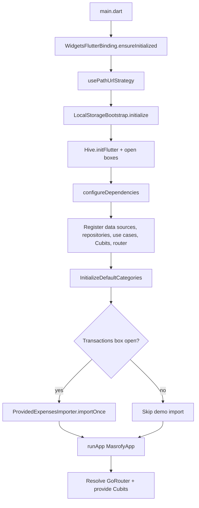
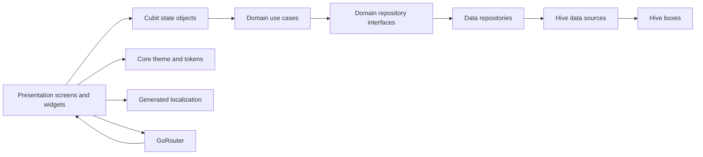
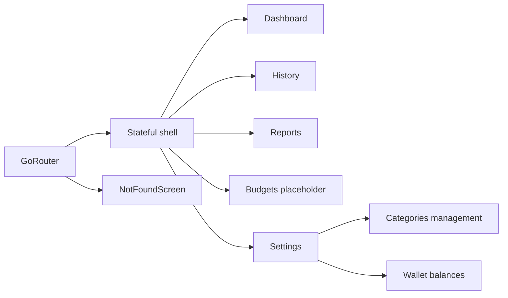
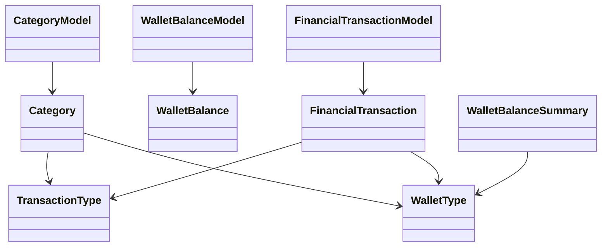

# Flutter Mobile App — Complete Project Analysis

## 1. Executive Summary

Masrofy is an offline-first expense tracking app focused on recording income and expenses, browsing transaction history, reviewing spending summaries, managing category metadata, and maintaining wallet balances for selected digital wallets. The confirmed user-facing flows are the dashboard, history, reports, budgets placeholder, settings, category management, and wallet balance management. The app name is Masrofy in English and مصروفي in Arabic, with Arabic as the stored default locale.

The repository uses a clean layered structure with presentation, domain, data, and core folders. Presentation state is built with Cubit from flutter_bloc, routing is declarative with go_router, dependency wiring uses GetIt, and persistence is handled locally with Hive. Models use a mix of Freezed and Equatable, localization is generated from ARB files, and the UI uses Material 3 plus a small custom design-token layer.

The strongest parts of the codebase are the separation between UI and domain logic, the presence of useful unit and widget tests, the responsive layout utilities, and the localized Arabic/English experience. The most serious risks are the placeholder budgets screen, the absence of any verified release-ready signing or store configuration, plain-text local storage for financial data, and the automatic import of fixed sample expenses during startup.

This is safe to continue feature development on, but not yet safe to treat as production-ready without stabilizing the release configuration, deciding what to do with the seeded demo data, and clarifying whether local financial data needs encryption or export/privacy controls.

## 2. Analysis Scope and Method

This report is based on static inspection of the current repository state only, plus safe read-only validation commands. The main evidence sources were the app entry point, routing and DI setup, core storage/theme files, presentation screens and Cubits, domain use cases and entities, data sources and models, localization files, tests, platform configuration, and Git status. Generated files were inspected only to confirm serialization/localization behavior and were not modified.

Commands executed during analysis:

- git status --short; git branch --show-current; git rev-parse HEAD
- flutter --version; dart --version
- flutter analyze
- flutter test
- git status --short

## 3. Repository Status During Analysis

- Current branch: main
- Current commit hash: c39e8e043123c8df1e840a89ce1290dba5e14873
- Working tree before analysis: clean
- Modified files before analysis: none
- Untracked files before analysis: none
- Analysis commands changed files: no
- Final Git status: clean

Repository notes:

- No source files were modified during analysis.
- No generated files were regenerated during analysis.
- The report file itself was created in the project root as a new documentation artifact.

## 4. Application Overview

Confirmed purpose: personal expense tracking and wallet balance management.

Confirmed user-facing areas:

- Dashboard for today/week/month summaries and recent transactions
- History view grouped by day
- Reports view aggregating expenses by category
- Budgets screen, currently a placeholder empty state
- Settings for locale, theme, wallet balances, and category management
- Category management for default and custom categories
- Wallet balance editing for InstaPay and Vodafone Cash
- Add transaction bottom sheet

Current maturity:

- The app is functionally coherent for local expense tracking.
- Core persistence, category seeding, transaction saving, history, reporting, and settings are implemented.
- Budgeting exists only as a stub screen.
- No backend, auth, sync, or monetization flow is implemented.

## 5. Supported Platforms and Build Targets

Confirmed platform folders exist for Android, iOS, web, macOS, Windows, and Linux. The actual app behavior is primarily mobile-oriented, but the Flutter scaffold for desktop and web is present.

Statically confirmed platform behavior:

- Android launcher activity exists and uses standard FlutterActivity.
- iOS uses the standard Flutter app delegate and scene delegate.
- Web uses path URL strategy from the Flutter app bootstrap.
- macOS, Windows, and Linux contain standard template runners with no app-specific platform logic.

Unknown or unverified:

- Which platforms are actively supported in product terms.
- Whether desktop/web are meant to be release targets or are only scaffold leftovers.

## 6. Technology Stack

Confirmed stack:

- Flutter and Dart on beta channel: Flutter 3.42.0-0.4.pre and Dart 3.12.0-113.2.beta
- Material 3 theming
- go_router for navigation
- flutter_bloc for Cubits and BlocBuilder/BlocConsumer
- get_it for dependency injection
- Hive and hive_flutter for local persistence
- freezed_annotation and generated Freezed models
- equatable for immutable state and entity equality
- intl and flutter_localizations for localization and date/number formatting
- uuid for generated identifiers
- widget preview support through flutter/widget_previews.dart in one preview-only file

Declared but not active in app code:

- connectivity_plus
- flutter_dotenv
- flutter_local_notifications
- fl_chart
- excel
- pdf
- printing

## 7. Project Structure

Important structure map:

```text
lib/
├── app/                      Application root widget
├── core/                     Shared storage, settings, and theme infrastructure
├── data/                     Local models, data sources, repositories, seeded data
├── di/                       GetIt service registration
├── domain/                   Entities, repositories, use cases
├── l10n/                     ARB files and generated localization
├── presentation/             Screens, reusable widgets, Cubits, shell
├── routing/                  go_router configuration
└── main.dart                 Startup entry point
```

Responsibilities by major directory:

- lib/app: root app widget and app-wide providers
- lib/core: local storage bootstrap, app settings storage, theme tokens, theme extension
- lib/data: Hive-backed implementations, serializable models, demo data seeding
- lib/domain: pure business rules and repository contracts
- lib/presentation: screens, reusable widgets, Cubits, and shell navigation
- lib/routing: route definitions and shell route assembly
- lib/l10n: localized strings and generated delegates

No assets directory is declared in pubspec.yaml.

## 8. Application Startup and Initialization Flow

Confirmed startup order from [lib/main.dart](lib/main.dart):

1. WidgetsFlutterBinding.ensureInitialized()
2. usePathUrlStrategy()
3. LocalStorageBootstrap.initialize()
4. configureDependencies()
5. runApp(MasrofyApp())

The first two steps are synchronous setup. LocalStorageBootstrap opens Hive and four versioned string boxes. configureDependencies then builds the GetIt graph, seeds default categories, and conditionally imports provided expenses if the transactions box is already open.

The app widget then resolves the GoRouter and injects AppSettingsCubit plus a loaded TransactionsCubit into the widget tree. The Settings Cubit is a lazy singleton; the Transactions Cubit is created per app tree build and immediately calls load().

Startup flow diagram:



Blocking or fragile startup operations:

- Hive initialization and box opening
- Service locator registration
- Default category seeding
- Optional demo-transaction import

No Firebase, auth restoration, remote config, analytics, orientation lock, or zone error handler is present.

## 9. Architecture Analysis

The app is a layered Flutter application with a clear domain boundary and local data implementation.

Observed dependency flow:

- Presentation depends on domain use cases and domain entities
- Domain defines repository interfaces and business rules
- Data implements the repository interfaces using Hive-backed data sources
- Core provides storage and theme infrastructure shared by presentation and DI

Architecture characteristics:

- Mostly clean architecture in practice
- Feature-oriented presentation organization for the visible screens
- Repository-service layering for local persistence
- Cubit-based presentation logic rather than event-based Bloc or Riverpod

Architecture inconsistencies:

- Category state uses Freezed while transaction, wallet, and settings states use Equatable
- Some business calculations happen inside screen widgets, especially dashboard and reports totals
- Budgeting is architecturally present in routing but functionally stubbed

Architecture diagram:



## 10. Dependency Direction and Module Boundaries

Confirmed boundaries:

- Presentation imports domain entities and use cases, not Hive boxes directly
- Data imports domain entities to map to and from storage models
- Domain repositories are abstract interfaces
- Core contains storage bootstrap and app settings storage implementations

Cross-feature dependencies:

- TransactionsCubit depends on WatchCategories to populate the category chooser in the add-transaction sheet
- WalletBalancesCubit depends on TransactionRepository and WalletBalanceRepository to compute current wallet balances
- Settings screen pushes to category and wallet-balance management routes

No circular dependency was identified in the inspected files.

## 11. Complete Feature Inventory

Feature matrix:

| Feature | Main files | State management | Data source | Status | Notes |
|---|---|---|---|---|---|
| Dashboard | [lib/presentation/screens/dashboard/dashboard_screen.dart](lib/presentation/screens/dashboard/dashboard_screen.dart), [lib/presentation/widgets/transactions/transaction_list_tile.dart](lib/presentation/widgets/transactions/transaction_list_tile.dart) | TransactionsCubit | Transactions stream + categories stream | Mostly complete | Calculates today/week/month summaries in the screen |
| History | [lib/presentation/screens/history/history_screen.dart](lib/presentation/screens/history/history_screen.dart) | TransactionsCubit | Transactions stream + categories stream | Mostly complete | Groups transactions by day and supports delete |
| Reports | [lib/presentation/screens/reports/reports_screen.dart](lib/presentation/screens/reports/reports_screen.dart) | TransactionsCubit | Transactions stream | Mostly complete | Category-based expense aggregation |
| Budgets | [lib/presentation/screens/budgets/budgets_screen.dart](lib/presentation/screens/budgets/budgets_screen.dart) | None | None | Placeholder | Empty state only |
| Settings | [lib/presentation/screens/settings/settings_screen.dart](lib/presentation/screens/settings/settings_screen.dart) | AppSettingsCubit | Hive-backed settings store | Mostly complete | Locale, theme, and entry points to subfeatures |
| Categories management | [lib/presentation/screens/settings/categories/categories_screen.dart](lib/presentation/screens/settings/categories/categories_screen.dart) | CategoriesCubit | Category repository + Hive | Mostly complete | Built-in and custom categories, visibility, default wallet |
| Wallet balances | [lib/presentation/screens/settings/wallets/wallet_balances_screen.dart](lib/presentation/screens/settings/wallets/wallet_balances_screen.dart) | WalletBalancesCubit | Wallet and transaction repositories | Mostly complete | Tracks InstaPay and Vodafone Cash only |
| Add transaction sheet | [lib/presentation/widgets/transactions/add_transaction_sheet.dart](lib/presentation/widgets/transactions/add_transaction_sheet.dart) | TransactionsCubit + local widget state | Transaction use case | Mostly complete | Local form state lives in the widget |
| Startup seeding | [lib/data/catalog/default_category_catalog.dart](lib/data/catalog/default_category_catalog.dart), [lib/data/seed/provided_expenses_importer.dart](lib/data/seed/provided_expenses_importer.dart) | None | Hive repositories | Mostly complete | Default categories are seeded; demo expenses are imported once |
| Localization | [lib/l10n/app_ar.arb](lib/l10n/app_ar.arb), [lib/l10n/app_en.arb](lib/l10n/app_en.arb) | AppSettingsCubit | Generated localization | Complete | Arabic and English |
| Theme system | [lib/core/theme/app_theme.dart](lib/core/theme/app_theme.dart) | AppSettingsCubit | Hive-backed settings store | Mostly complete | Material 3 with semantic extension colors |

Major feature details:

### Dashboard

Purpose: show current financial summary and recent transactions.

User entry points: dashboard branch in bottom navigation.

Main screens: DashboardScreen.

Routes: /dashboard.

State management: TransactionsCubit.

Services and repositories: WatchTransactions, WatchCategories.

Models: FinancialTransaction, Category.

Local persistence: transactions_v1 and categories_v1 Hive boxes.

Implementation status: mostly complete.

Known issues or risks: summaries are recomputed in the widget tree each rebuild; no pagination.

Important files: [lib/presentation/screens/dashboard/dashboard_screen.dart](lib/presentation/screens/dashboard/dashboard_screen.dart), [lib/presentation/widgets/transactions/transaction_formatters.dart](lib/presentation/widgets/transactions/transaction_formatters.dart)

### History

Purpose: browse transaction history grouped by day and delete entries.

User entry points: history branch and bottom navigation.

Main screens: HistoryScreen.

Routes: /history.

State management: TransactionsCubit.

Implementation status: mostly complete.

Known issues or risks: grouping is performed on every rebuild; no filtering or search.

### Reports

Purpose: aggregate expenses by category and show ratios.

Routes: /reports.

Implementation status: mostly complete.

Known issues or risks: no charting despite fl_chart being declared; the screen is purely textual/progress-based.

### Budgets

Purpose: future budget functionality.

Routes: /budgets.

Implementation status: placeholder.

Known issues or risks: reachable route but no budgeting logic exists.

### Settings

Purpose: change language, theme, and navigate to category/wallet management.

Routes: /settings.

State management: AppSettingsCubit.

Implementation status: mostly complete.

### Category management

Purpose: inspect built-in categories, create custom categories, change visibility, and select a default wallet.

Routes: /settings/categories.

State management: CategoriesCubit.

Implementation status: mostly complete.

Known issues or risks: custom categories are persisted locally only; business rules are enforced in use cases, which is good, but the screen still holds save orchestration logic.

### Wallet balances

Purpose: edit the current balance for supported digital wallets and recompute current balance from transactions.

Routes: /settings/wallet-balances.

State management: WalletBalancesCubit.

Implementation status: mostly complete.

Known issues or risks: only InstaPay and Vodafone Cash are tracked in the summary calculator; cash is not part of wallet balance summaries.

### Add transaction sheet

Purpose: create a new transaction with amount, category, wallet, note, date, and optional person name.

Implementation status: mostly complete.

Known issues or risks: category selection depends on the currently loaded category stream; form state is local and impermanent until save.

## 12. Main User Journeys

Confirmed flows:

- Fresh install: startup initializes Hive, registers dependencies, seeds default categories, and opens the dashboard.
- Authenticated startup: not applicable; no auth exists.
- Unauthenticated startup: not applicable; no auth exists.
- Dashboard browsing: default shell opens on /dashboard.
- Add transaction: floating action button opens a bottom sheet, validates input, saves locally, and closes on success.
- History browsing: transactions are grouped by day and can be deleted.
- Reports browsing: expenses are aggregated by category.
- Category management: user can switch expense/income type, hide/show categories, choose default wallets, and add custom categories.
- Wallet balance management: user can set a current balance per tracked wallet; transactions update the current value.
- Locale/theme changes: settings are persisted in Hive and reflected across the app.
- Unknown route: NotFoundScreen renders.

Not detected:

- Login, registration, password reset, OTP, social login, logout, premium gating, deep-link auth redirects.

## 13. State Management

Confirmed techniques:

- flutter_bloc Cubits
- Equatable state classes
- Freezed immutable state for category management
- Local StatefulWidget state for forms and dialogs

Inventory:

| System | Where initialized | Names | State shape | Persistence | Notes |
|---|---|---|---|---|---|
| AppSettingsCubit | GetIt singleton, injected into MasrofyApp | AppSettingsCubit, AppSettingsState | locale + themeMode | Hive settings_v1 | Persists user preferences immediately on change |
| TransactionsCubit | Created in MasrofyApp and route providers | TransactionsCubit, TransactionsState | status, transactions, categories, isSaving, errorMessage | Hive via repos | Subscribes to two streams and owns cancellation |
| CategoriesCubit | Created for /settings/categories route | CategoriesCubit, CategoriesState | status, categories, selectedType, isSaving, error | Hive via repos | Handles loading, mutation, and error mapping |
| WalletBalancesCubit | Created for /settings/wallet-balances route | WalletBalancesCubit, WalletBalancesState | status, summaries, isSaving, errorMessage | Hive via repos | Recomputes summaries from balance and transaction streams |
| Local form state | Widget-local | AddTransactionSheet, CategoryEditorSheet, WalletBalanceDialog | controllers, selections, date | None | Ephemeral UI state only |

Notable state risks:

- TransactionsCubit keeps both transactions and categories in state, which is fine but broadens rebuild scope.
- CategoriesCubit and WalletBalancesCubit each maintain stream subscriptions and must be disposed, which they do.
- Dashboard and Reports also compute totals in widget build methods rather than delegating to dedicated presentation models.

## 14. Navigation and Routing

Navigation package: go_router.

Route structure:

| Route | Screen | Parameters | Guard | Entry source | Notes |
|---|---|---|---|---|---|
| /dashboard | DashboardScreen | none | none | Initial location, bottom nav branch | Default startup route |
| /history | HistoryScreen | none | none | Bottom nav branch | Transaction list by date |
| /reports | ReportsScreen | none | none | Bottom nav branch | Expense aggregation |
| /budgets | BudgetsScreen | none | none | Bottom nav branch | Placeholder |
| /settings | SettingsScreen | none | none | Bottom nav branch | Theme/language/settings hub |
| /settings/categories | CategoriesScreen | none | none | Settings tile | Top-level route outside the shell branch |
| /settings/wallet-balances | WalletBalancesScreen | none | none | Settings tile | Top-level route outside the shell branch |

Confirmed routing features:

- StatefulShellRoute.indexedStack for the five main tabs
- Bottom NavigationBar driven by StatefulNavigationShell
- errorBuilder for unknown routes
- No redirects, no auth guards, no query or path parameters, no navigation observers

Navigation flow diagram:



Potential navigation risks:

- No redirect logic exists for future auth or premium flows
- Settings routes are pushed outside the shell, so back behavior depends on the stack created by push
- Budgets route exists but leads to a placeholder screen, which is easy to misread as feature-complete

## 15. Dependency Injection and Service Registration

Mechanism: GetIt singleton instance in [lib/di/service_locator.dart](lib/di/service_locator.dart).

Registration order:

1. Create Hive-backed or in-memory settings store/data sources depending on box availability
2. Register repositories
3. Register use cases
4. Register Cubits
5. Register AppRouter and GoRouter
6. Seed default categories
7. Import provided expenses if the transactions box is open

Dependency table:

| Dependency | Type | Registration | Consumers | Lifetime | Notes |
|---|---|---|---|---|---|
| AppSettingsStore | singleton | registerSingleton | AppSettingsCubit | app lifetime | Hive-backed or in-memory fallback |
| CategoryLocalDataSource | singleton | registerSingleton | CategoryRepositoryImpl | app lifetime | Hive-backed or in-memory fallback |
| TransactionLocalDataSource | singleton | registerSingleton | TransactionRepositoryImpl | app lifetime | Hive-backed or in-memory fallback |
| WalletBalanceLocalDataSource | singleton | registerSingleton | WalletBalanceRepositoryImpl | app lifetime | Hive-backed or in-memory fallback |
| CategoryRepository | lazy singleton | registerLazySingleton | category use cases and cubit | app lifetime | Local only |
| TransactionRepository | lazy singleton | registerLazySingleton | transaction use cases and cubits | app lifetime | Local only |
| WalletBalanceRepository | lazy singleton | registerLazySingleton | wallet balance use cases and cubit | app lifetime | Local only |
| Use cases | lazy singletons | registerLazySingleton | Cubits | app lifetime | Thin wrappers around repositories |
| CategoriesCubit | factory | registerFactory | Categories route | per route instance | Separate instance per route open |
| TransactionsCubit | factory | registerFactory | App shell | per app tree instance | Loaded in MasrofyApp |
| WalletBalancesCubit | factory | registerFactory | Wallet balances route | per route instance | Separate instance per route open |
| AppSettingsCubit | lazy singleton | registerLazySingleton | App shell and settings screen | app lifetime | Persistent preference state |
| AppRouter and GoRouter | lazy singleton | registerLazySingleton | MasrofyApp | app lifetime | Router reused globally |

Observations:

- The code defensively resets GetIt if a category data source is already registered.
- Hive boxes are not explicitly closed in the normal app flow, which is acceptable for a mobile app process lifetime but not formally managed.

## 16. Networking and API Integration

Not detected in the current repository.

Confirmed absence:

- No HTTP client
- No base URL
- No API versioning
- No interceptors
- No token refresh logic
- No GraphQL
- No WebSocket usage
- No multipart upload or file download code
- No offline sync with a remote backend

The app is local-only from the inspected code.

## 17. API Endpoint Inventory

Not detected in the current repository.

There are no statically confirmed network endpoints.

## 18. Authentication and Session Management

Not detected in the current repository.

Confirmed absence:

- No login or registration flow
- No Firebase Authentication integration
- No stored auth token or session token
- No refresh token logic
- No logout or account deletion flow
- No role-based access control
- No biometric authentication

Startup does not branch on authentication state.

## 19. Models, Entities, and Data Mapping

Confirmed domain entities:

- Category
- FinancialTransaction
- WalletBalance
- WalletBalanceSummary
- WalletType
- TransactionType
- CategoryBehavior

Confirmed storage models:

- CategoryModel
- FinancialTransactionModel
- WalletBalanceModel

Mapping behavior:

- CategoryModel and FinancialTransactionModel convert to/from domain objects.
- JSON is encoded manually to Hive string boxes.
- Legacy category JSON is normalized for is_hidden and default_wallet snake-case fields.
- FinancialTransactionModel and WalletBalanceModel use DateTime.tryParse with fallback to DateTime.now for missing or malformed dates.

Model relationship summary:



Data-mapping risks:

- Invalid stored dates silently fall back to now in transaction and wallet-balance models
- Unknown enum values sometimes fall back to defaults or null, which is safe but can hide data drift
- All local storage is plain-text JSON in Hive string boxes

## 20. Local Storage and Cache

Confirmed storage mechanism: Hive.

Boxes:

| Box | Type | Purpose | Written by | Read by | Cleared when |
|---|---|---|---|---|---|
| categories_v1 | String | Serialized category records | Category repository/use cases | Category repository, transactions cubit, categories screen | Not cleared automatically |
| transactions_v1 | String | Serialized transactions | Transaction repository/use cases | Dashboard, history, reports, wallet balances | Not cleared automatically |
| settings_v1 | String | locale and theme | AppSettingsCubit | AppSettingsCubit and app shell | Not cleared automatically |
| wallet_balances_v1 | String | Serialized wallet balances | Wallet balance repository/use cases | WalletBalancesCubit | Not cleared automatically |

Confirmed keys and storage areas:

- settings_v1: locale, themeMode
- category records: id as Hive key, JSON record as value
- transaction records: id as Hive key, JSON record as value
- wallet balance records: walletType.name as Hive key, JSON record as value

Cache and lifecycle notes:

- No encryption layer is present.
- No migration manager beyond the category JSON normalization helper.
- In-memory data sources exist only for tests and previews.

## 21. Firebase and Third-Party Integrations

Not detected in the current repository.

Confirmed absence of app-level integrations:

- Firebase Core, Auth, Firestore, Messaging, Crashlytics, Analytics, Remote Config, Dynamic Links, App Check, Performance Monitoring
- Google Sign-In, Apple Sign-In, Facebook Login
- Stripe, PayPal, RevenueCat, Google Play Billing, App Store subscriptions
- AdMob, OneSignal, Sentry, Supabase, Agora, Twilio, Gemini, OpenAI

Declared but unused packages relevant to this section:

- flutter_local_notifications
- connectivity_plus
- flutter_dotenv
- fl_chart
- excel
- pdf
- printing

No confidential IDs or keys were present in the inspected app code.

## 22. Payments, Subscriptions, Purchases, and Ads

Not detected in the current repository.

Confirmed absence:

- No purchase flow
- No premium state
- No entitlement storage
- No restore-purchase flow
- No ad placement
- No paywall screen

The budgets screen is not a monetization surface; it is a placeholder feature screen.

## 23. UI Architecture and Reusable Components

Confirmed reusable UI building blocks:

- EmptyState
- LoadingSkeleton
- TransactionListTile
- AddTransactionSheet
- CategoryCard
- CategoryEditorSheet
- Category icon picker, color picker, wallet picker
- App theme extension and design tokens
- Widget previews for three representative widgets

UI structure notes:

- Main content screens use CustomScrollView and slivers for long content.
- Settings uses sections and list tiles.
- The app shell uses a floating action button and bottom navigation.
- Most UI state is presentation-only and kept out of the domain layer.

Potential design-system gaps:

- There is no dedicated font family override.
- Some text styles are still defined inline in private widgets for emphasis.
- Business-summary calculations occur inside widgets instead of dedicated presentation services.

## 24. Theme, Dark Mode, Typography, and Design System

Confirmed theme system:

- Material 3 enabled
- ColorScheme.fromSeed for both light and dark themes
- Custom semantic colors via MasrofyThemeExtension: income, expense, warning, success, danger, info
- Centralized spacing, radii, elevation, icon size, and breakpoint tokens in AppSpacing, AppRadii, AppElevation, AppIconSizes, and AppBreakpoints
- Theme mode persisted in Hive and applied through AppSettingsCubit

Typography notes:

- TextTheme is explicitly customized for headlineMedium, titleLarge, titleMedium, bodyMedium, and labelLarge
- No custom font family is declared

RTL notes:

- Arabic is the default stored locale
- Localization strings are provided in Arabic and English
- Icon direction handling is mostly left to Material and Flutter defaults

Design risks:

- No runtime contrast validation was performed
- Some screens still contain inline layout constants, though the main spacing system is centralized

## 25. Localization and RTL Support

Confirmed localization setup:

- l10n.yaml uses lib/l10n as the ARB source directory
- Template file: app_ar.arb
- Generated file output: lib/l10n/generated/app_localizations.dart
- Supported locales: ar and en

Confirmed behavior:

- AppSettingsCubit persists localeCode in Hive
- Default locale is Arabic
- App title comes from AppLocalizations.appName
- Currency symbol is localized via the generated strings
- Dates are formatted with locale-aware helpers in transaction_formatters.dart

Hardcoded user-facing text risk:

- Some preview/demo strings and test fixtures are hardcoded, but app screens are localized

## 26. Assets

No application asset declarations were found in pubspec.yaml.

Confirmed asset-related observations:

- The app uses Material icons and custom icon mapping rather than a declared image/font asset set.
- Native platform icon and launch image asset catalogs exist in iOS and macOS.
- Web icon and manifest assets exist under web/.

Potential issues:

- No declared app assets means there is no app-specific asset inventory to validate.
- There is no evidence of missing asset declarations because no app assets were declared.

## 27. Permissions

Permissions matrix:

| Permission | Platform | Requested by | Runtime flow | User explanation | Risk |
|---|---|---|---|---|---|
| Camera | none detected | none | none | none | none |
| Microphone | none detected | none | none | none | none |
| Photos | none detected | none | none | none | none |
| Storage | none detected | Hive app-private storage only | none | none | low |
| Location | none detected | none | none | none | none |
| Notifications | none detected | none | none | none | none |
| Bluetooth | none detected | none | none | none | none |
| Contacts | none detected | none | none | none | none |
| Calendar | none detected | none | none | none | none |
| Background execution | none detected | none | none | none | none |
| Tracking | none detected | none | none | none | none |
| Biometrics | none detected | none | none | none | none |
| Internet | not declared in Android manifest | none | no network code exists | none | low |

## 28. Android Configuration

Confirmed configuration:

- Application ID: com.example.masrofy
- Namespace: com.example.masrofy
- Compile SDK, min SDK, and target SDK come from Flutter Gradle defaults
- Java 17 and Kotlin JVM target 17
- Core library desugaring enabled
- Release build currently uses the debug signing config
- Main activity is a standard FlutterActivity
- Only launcher intent filter is present

Not detected:

- Product flavors
- Deep links or app links
- Firebase configuration
- Notification channels or receivers
- ProGuard/R8 customization
- File provider setup

Risk note:

- The Android build configuration is template-level and not production-hardened.

## 29. iOS Configuration

Confirmed configuration:

- Bundle display name: Masrofy
- Bundle identifier comes from build settings
- Standard Flutter app delegate and scene delegate are present
- No custom capabilities are declared in the inspected files
- No usage-description keys for camera, contacts, location, photos, microphone, or notifications were found in Info.plist

Not detected:

- Push notifications
- Background modes
- Associated domains
- URL schemes
- Firebase setup
- StoreKit configuration

## 30. Other Platform Configuration

Web:

- Uses path URL strategy from main.dart
- web/index.html and web/manifest.json are still the default Flutter template style
- Web manifest declares portrait-primary orientation and generic metadata

Windows:

- Standard template runner only

macOS:

- Standard template runner only

Linux:

- Standard template runner only

Confirmed status:

- These platform folders exist but appear uncustomized and are not platform-feature-rich.

## 31. Error Handling and Logging

Confirmed error handling patterns:

- Cubits emit errorMessage or error enums for user-facing feedback
- Category and wallet balance management provide retry states when no data is loaded
- Transactions and category loading handle stream errors with localized messages
- Validation exceptions are used for domain-level category and transaction constraints

Logging:

- No logging package is used in the inspected app code
- No debugPrint or print calls were found in lib/

Limitations:

- Generic catch blocks swallow the original error details before showing user messages
- No central error-reporting service exists

## 32. Analytics, Monitoring, and Crash Reporting

Not detected in the current repository.

No analytics events, crash-reporting SDK, or monitoring dashboard integration was found.

## 33. Testing and Code Quality

Validated results:

- flutter analyze: No issues found
- flutter test: All tests passed, 43 tests

Test inventory:

- Unit tests for category repository, transaction repository, category models, transaction models, default category catalog, category use cases, wallet balance use cases
- Cubit tests for categories and app settings
- Widget test for the app shell and transaction flow
- Widget test for categories screen behavior
- Repository and data-source tests for Hive-backed local persistence

Missing or unverified:

- No integration_test Dart files were found
- No golden tests were found
- Coverage was not measured during this analysis

Quality controls:

- analysis_options.yaml enables flutter_lints and strict cast/inference rules
- avoid_print is enabled

## 34. Dependency Analysis

Confirmed direct dependencies and their observed usage:

| Package | Declared version | Purpose | Observed status |
|---|---|---|---|
| flutter | sdk | App framework | active |
| cupertino_icons | ^1.0.8 | icon font helper | not clearly used in app code |
| flutter_localizations | sdk | localization delegates | active |
| intl | any | date/number formatting and localization support | active |
| go_router | ^17.3.0 | navigation | active |
| get_it | ^9.2.1 | dependency injection | active |
| flutter_bloc | ^9.1.1 | Cubits and Bloc widgets | active |
| equatable | ^2.1.0 | immutable equality for entities/states | active |
| hive | ^2.2.3 | local storage | active |
| hive_flutter | ^1.1.0 | Hive initialization for Flutter | active |
| path_provider | ^2.1.6 | storage helper | not used in app code |
| connectivity_plus | ^7.2.0 | network status helper | unused in app code |
| flutter_dotenv | ^6.0.1 | env loading | unused in app code |
| fl_chart | ^1.2.0 | charting | unused in app code |
| flutter_local_notifications | ^22.0.1 | notifications | unused in app code |
| excel | ^4.0.6 | spreadsheet export | unused in app code |
| pdf | ^3.12.0 | PDF generation | unused in app code |
| printing | ^5.14.3 | printing/PDF preview | unused in app code |
| freezed_annotation | ^3.1.0 | immutable generated models | active |
| json_annotation | ^4.12.0 | generated JSON serialization | active in generated layer |
| uuid | ^4.5.3 | generated IDs | active |
| flutter_web_plugins | sdk | web URL strategy | active |

Dev dependencies:

- flutter_test, flutter_lints, build_runner, freezed, json_serializable, mockito, bloc_test, coverage, checks, integration_test

Observed notes:

- bloc_test is used.
- mockito and checks were not found in the inspected Dart code.
- integration_test exists as a dev dependency, but no integration test Dart files were found.

## 35. Environment and Configuration Management

Confirmed environment/configuration sources:

- l10n.yaml for localization generation
- analysis_options.yaml for analyzer and lint rules
- pubspec.yaml for package declarations and app metadata
- Hive boxes for runtime settings/persistence

Not detected:

- .env files
- flavor-specific runtime environment switching
- remote config or build-time backend selection

## 36. Security and Privacy Review

Findings:

1. Plain-text local financial data in Hive string boxes. Severity: medium. Evidence: categories_v1, transactions_v1, settings_v1, and wallet_balances_v1 store JSON strings without encryption. Potential impact: local-device disclosure if storage is accessed. Recommended action: decide whether encryption is needed for financial data.
2. Release Android build uses debug signing config. Severity: high. Evidence: android/app/build.gradle.kts release block signs with debug keys. Potential impact: release builds would not be production-safe. Recommended action: replace with proper release signing before shipping.
3. Automatic import of seeded expense records with personal names. Severity: low to medium. Evidence: provided_expenses_importer.dart imports fixed sample records on startup when the transactions box is open. Potential impact: demo data may confuse users or leak sample personal names into real local data. Recommended action: decide whether this behavior should remain in production.

No hardcoded secrets, API tokens, service-account credentials, or private keys were found in the inspected repository code.

## 37. Performance Review

Confirmed strengths:

- Sliver-based long screens
- Stream-based local persistence updates
- Small reusable widgets
- Proper Cubit disposal of stream subscriptions

Potential performance risks:

- Dashboard, history, reports, and wallet balance views recompute aggregates from full in-memory transaction lists on rebuild.
- No pagination or lazy server-backed loading exists.
- Category and wallet balance screens can rebuild wide sections when state changes.

Severity and confidence:

- Aggregate recomputation risk: low to medium severity, high confidence
- No undisposed subscriptions found in the inspected Cubits: low severity, confirmed
- Large-data scalability not verified at runtime: requires runtime verification

## 38. Dead, Duplicate, and Legacy Code

Confirmed or likely unused/placeholder items:

- BudgetsScreen is a placeholder screen but remains routed and visible in the shell.
- The widget preview file is preview-only and not referenced by runtime code.
- Declared dependencies such as connectivity_plus, flutter_dotenv, flutter_local_notifications, fl_chart, excel, pdf, and printing are not used in lib/.
- No integration_test Dart files were found.

Legacy-but-referenced items:

- provided_expenses_importer.dart is intentionally referenced during dependency setup and seeds demo data.
- Default category catalog is legacy-friendly seeded content, not dead code.

Cannot determine safely:

- Whether the demo expense import is intentional product behavior or temporary scaffolding.

## 39. Technical Debt

Most important debt items in priority order:

1. Release configuration is not production-ready because Android release signing uses debug keys.
2. Budgets is an exposed but unimplemented product area.
3. Local financial data is stored as plain-text JSON in Hive boxes.
4. Demo expenses are imported automatically at startup when a data box exists.
5. There is no integration-test coverage for end-to-end flows.
6. Several declared dependencies are unused, which increases maintenance surface.
7. Some summary computations are kept in the widget layer instead of dedicated presentation logic.

## 40. Known Bugs and Suspicious Behaviors

Confirmed suspicious behaviors:

- The app seeds fixed sample expenses with dates and Arabic personal names through ProvidedExpensesImporter.
- The budgets route is reachable but only shows an empty-state placeholder.
- Wallet balance summaries only track InstaPay and Vodafone Cash, not all possible wallet types.

Not confirmed as bugs, but worth watching:

- No runtime check was performed for locale-specific formatting edge cases.
- No large-data stress test was performed for dashboard and history aggregation.

## 41. External Configuration That Cannot Be Verified

Not verifiable from repository code alone:

- Which Play Console or App Store Connect project, if any, is intended for release
- Whether debug signing is intentional for all build variants or just a temporary state
- Whether the seeded demo expenses are meant to ship in production
- Whether the unused integration packages are reserved for future features
- Whether the supported platforms are all intended to be released or only the mobile targets

## 42. Risk Register

| ID | Risk | Category | Severity | Confidence | Evidence | Potential Impact | Recommended Action |
|---|---|---|---|---|---|---|---|
| R1 | Android release builds are signed with debug keys | Release readiness | High | Confirmed | android/app/build.gradle.kts release block | Production distribution is not safe | Replace with proper release signing before shipping |
| R2 | Financial data is stored as plain-text JSON in Hive | Security/privacy | Medium | Confirmed | Local storage boxes in lib/core/storage and data sources | Local-device disclosure risk | Decide on encryption or document local-only storage explicitly |
| R3 | Budgets route is exposed but unimplemented | Product completeness | Medium | Confirmed | BudgetsScreen returns EmptyState only | User-facing feature gap | Define or hide budgets until implemented |
| R4 | Startup imports fixed demo expenses | Data integrity / UX | Medium | Confirmed | ProvidedExpensesImporter called from DI bootstrap | Users may see unexpected seeded records | Decide if demo data should remain in production |
| R5 | No integration tests exist | Quality | Medium | Confirmed | No integration_test Dart files found | End-to-end regressions may slip through | Add integration coverage for the main flows |
| R6 | Summary calculations run inside widgets over full lists | Performance | Low | High confidence | Dashboard/history/reports widgets | Large data sets may rebuild expensively | Move aggregations to dedicated presentation logic if data grows |
| R7 | Several declared dependencies are unused | Maintainability | Low | Confirmed | grep across lib/ found no usage | Maintenance and audit overhead | Remove or justify dependencies in a later cleanup phase |

## 43. Recommended Development Roadmap

### Phase 0 — Safety and Baseline

Goals:

- Preserve current clean state
- Document and confirm the actual supported platforms
- Decide whether seeded demo expenses are intentional product behavior
- Decide whether local storage needs encryption

Tasks:

- Keep repository clean and use this analysis as the baseline reference
- Verify release signing requirements outside the codebase
- Confirm whether budgets should remain a placeholder or be hidden until ready

Dependencies:

- Product owner decisions
- Store/account setup for release signing

Risks:

- Shipping without resolving release signing or storage policy

Expected outcome:

- A stable baseline for controlled feature development

Files or modules likely affected later:

- android/app/build.gradle.kts
- lib/data/seed/provided_expenses_importer.dart
- core storage layer

### Phase 1 — Critical Stability

Goals:

- Eliminate release-blocking configuration issues
- Decide on placeholder visibility and demo-data behavior

Tasks:

- Replace debug signing for release
- Clarify budgets behavior
- Confirm whether automatic demo imports should stay

Dependencies:

- External release configuration

Risks:

- Production release failure or confusing user data

Expected outcome:

- Release-ready configuration decisions are made

### Phase 2 — Architecture and Reliability

Goals:

- Reduce ambiguity and make future changes safer

- Improve test coverage for currently untested flows

Tasks:

- Add integration tests for dashboard, transaction creation, category management, and wallet balance editing
- Decide whether aggregate calculations should move out of widgets
- Trim unused declared dependencies if they are not planned

Dependencies:

- Test strategy and product scope

Risks:

- Over-refactoring before product decisions are finalized

Expected outcome:

- Lower regression risk and better future maintainability

### Phase 3 — User Experience

Goals:

- Finish visual and interaction polish

Tasks:

- Implement budgets properly or hide it until implemented
- Improve loading and empty-state polish where needed
- Validate responsive behavior on larger screens

Dependencies:

- Product design direction

Risks:

- UI polish without feature clarity

Expected outcome:

- More consistent and polished user experience

### Phase 4 — Feature Development

Goals:

- Add new value only after the base flows are stable

Tasks:

- Expand reporting and budgeting
- Decide whether export features should use excel, pdf, or printing
- Only add network or sync features if a backend is actually planned

Dependencies:

- Stable architecture and release config

Risks:

- Feature creep into unsupported dependencies

Expected outcome:

- A controlled feature backlog with clear scope

### Phase 5 — Release Readiness

Goals:

- Prepare for store submission or wider distribution

Tasks:

- Verify signing, bundle IDs, metadata, and privacy posture
- Re-run analysis and tests
- Confirm store assets and policy requirements externally

Dependencies:

- Google Play Console / App Store Connect / platform store decisions

Risks:

- Missing external configuration that cannot be verified in code

Expected outcome:

- Release candidate readiness

## 44. Safe Development Guidelines for Future Changes

1. Read this analysis file first before making changes.
2. Read rules.md and any other project instruction files before editing.
3. Check Git status before modifying anything.
4. Never overwrite or revert existing user changes.
5. Trace the full dependency chain before changing a Cubit, use case, repository, router, or shared widget.
6. Keep generated files treated as generated code.
7. Do not change unrelated files while working a narrow task.
8. Preserve backward compatibility for Hive-stored data unless a migration is explicitly planned.
9. Add or update tests for behavioral changes.
10. Run flutter analyze and relevant tests after each development phase.
11. Do not introduce new dependencies unless the product need is clear.
12. Do not modify signing, release, or store configuration unless that is the task.
13. Do not expose secrets or copy sensitive values into code or docs.
14. Treat budgets as incomplete until a real implementation exists.
15. Decide explicitly whether seeded demo data belongs in production before changing it.

## 45. Instructions for Future AI Coding Agents

1. Read this report before touching the repository.
2. Read all repository instruction files, including rules.md and any future AI guidance docs.
3. Inspect Git status first and report existing changes before editing.
4. Do not overwrite pre-existing user work.
5. Analyze the complete data flow before changing storage, state, or routing.
6. Keep edits narrow and avoid unrelated refactors.
7. Preserve generated files and do not hand-edit them unless explicitly required.
8. Do not change package versions, app versions, signing, or release settings without explicit instruction.
9. Add or update tests when you change behavior.
10. Run static analysis and the relevant tests after each phase.
11. Report every modified file and every external assumption.
12. Stop and ask if a flow touches unknown external configuration such as store consoles or backend services.
13. Do not remove legacy code silently.
14. Keep Hive schema and migration behavior backward-compatible.
15. Treat the demo-expense importer and budgets screen as intentional review points, not as proven product commitments.

Project-specific agent rules inferred from the codebase:

- Prefer the existing Cubit + GetIt + Hive stack for local features.
- Keep localization updates in ARB files and allow generation to update the derived files.
- Use the theme tokens in core/theme rather than hardcoding new spacing or color systems.
- Avoid adding network or auth infrastructure unless the product scope changes.

## 46. Important Files Reference

Application entry points:

- [lib/main.dart](lib/main.dart) — startup sequence, Hive initialization, DI registration, and app launch
- [lib/app/masrofy_app.dart](lib/app/masrofy_app.dart) — root widget, router injection, and app-wide Cubits

Routing:

- [lib/routing/app_router.dart](lib/routing/app_router.dart) — shell route, tab routes, extra settings routes, and not-found handling

Dependency injection:

- [lib/di/service_locator.dart](lib/di/service_locator.dart) — GetIt registrations, data seeding, and router wiring

Storage and settings:

- [lib/core/storage/local_storage_bootstrap.dart](lib/core/storage/local_storage_bootstrap.dart) — Hive initialization and box opening
- [lib/core/settings/app_settings_store.dart](lib/core/settings/app_settings_store.dart) — persisted locale/theme settings store

Theme and UI tokens:

- [lib/core/theme/app_theme.dart](lib/core/theme/app_theme.dart) — light/dark Material 3 themes
- [lib/core/theme/app_design_tokens.dart](lib/core/theme/app_design_tokens.dart) — spacing, radii, elevations, and breakpoints
- [lib/core/theme/masrofy_theme_extension.dart](lib/core/theme/masrofy_theme_extension.dart) — semantic color extension

Domain:

- [lib/domain/entities/category.dart](lib/domain/entities/category.dart) — category entity and behavior enum
- [lib/domain/entities/financial_transaction.dart](lib/domain/entities/financial_transaction.dart) — transaction entity
- [lib/domain/entities/wallet_balance.dart](lib/domain/entities/wallet_balance.dart) — wallet balance entity
- [lib/domain/usecases/categories/save_custom_category.dart](lib/domain/usecases/categories/save_custom_category.dart) — category validation and save rules
- [lib/domain/usecases/transactions/save_transaction.dart](lib/domain/usecases/transactions/save_transaction.dart) — transaction validation and persistence
- [lib/domain/usecases/wallets/set_wallet_current_balance.dart](lib/domain/usecases/wallets/set_wallet_current_balance.dart) — current balance calibration

Data layer:

- [lib/data/catalog/default_category_catalog.dart](lib/data/catalog/default_category_catalog.dart) — built-in category seed data
- [lib/data/seed/provided_expenses_importer.dart](lib/data/seed/provided_expenses_importer.dart) — fixed demo expenses imported on startup
- [lib/data/models/category_model.dart](lib/data/models/category_model.dart) — category JSON mapping and legacy normalization
- [lib/data/models/financial_transaction_model.dart](lib/data/models/financial_transaction_model.dart) — transaction JSON mapping
- [lib/data/models/wallet_balance_model.dart](lib/data/models/wallet_balance_model.dart) — wallet balance JSON mapping

Presentation and features:

- [lib/presentation/cubits/settings/app_settings_cubit.dart](lib/presentation/cubits/settings/app_settings_cubit.dart) — locale and theme state
- [lib/presentation/cubits/transactions/transactions_cubit.dart](lib/presentation/cubits/transactions/transactions_cubit.dart) — transaction and category stream state
- [lib/presentation/cubits/categories/categories_cubit.dart](lib/presentation/cubits/categories/categories_cubit.dart) — category management state
- [lib/presentation/cubits/wallets/wallet_balances_cubit.dart](lib/presentation/cubits/wallets/wallet_balances_cubit.dart) — wallet balance summaries
- [lib/presentation/screens/dashboard/dashboard_screen.dart](lib/presentation/screens/dashboard/dashboard_screen.dart) — dashboard UI
- [lib/presentation/screens/history/history_screen.dart](lib/presentation/screens/history/history_screen.dart) — history UI
- [lib/presentation/screens/reports/reports_screen.dart](lib/presentation/screens/reports/reports_screen.dart) — reports UI
- [lib/presentation/screens/settings/settings_screen.dart](lib/presentation/screens/settings/settings_screen.dart) — settings hub
- [lib/presentation/screens/settings/categories/categories_screen.dart](lib/presentation/screens/settings/categories/categories_screen.dart) — category management UI
- [lib/presentation/screens/settings/wallets/wallet_balances_screen.dart](lib/presentation/screens/settings/wallets/wallet_balances_screen.dart) — wallet balance UI
- [lib/presentation/widgets/transactions/add_transaction_sheet.dart](lib/presentation/widgets/transactions/add_transaction_sheet.dart) — transaction creation form

Localization:

- [lib/l10n/app_ar.arb](lib/l10n/app_ar.arb) — Arabic source strings
- [lib/l10n/app_en.arb](lib/l10n/app_en.arb) — English source strings
- [lib/l10n/generated/app_localizations.dart](lib/l10n/generated/app_localizations.dart) — generated localization API

Tests:

- [test/widget_test.dart](test/widget_test.dart) — high-level app shell behavior
- [test/data/repositories/category_repository_impl_test.dart](test/data/repositories/category_repository_impl_test.dart) — category repository behavior
- [test/data/repositories/transaction_repository_impl_test.dart](test/data/repositories/transaction_repository_impl_test.dart) — transaction repository behavior
- [test/domain/usecases/categories/category_usecases_test.dart](test/domain/usecases/categories/category_usecases_test.dart) — category business rules
- [test/domain/usecases/transactions/transaction_usecases_test.dart](test/domain/usecases/transactions/transaction_usecases_test.dart) — transaction validation
- [test/domain/usecases/wallets/wallet_balance_usecases_test.dart](test/domain/usecases/wallets/wallet_balance_usecases_test.dart) — wallet balance calculations

Platform configuration:

- [android/app/build.gradle.kts](android/app/build.gradle.kts) — Android build configuration
- [android/app/src/main/AndroidManifest.xml](android/app/src/main/AndroidManifest.xml) — Android manifest
- [ios/Runner/Info.plist](ios/Runner/Info.plist) — iOS app metadata
- [web/index.html](web/index.html) — web app shell metadata
- [web/manifest.json](web/manifest.json) — web manifest

## 47. Open Questions

Questions that cannot be answered from code alone:

- Is the budgets screen intended to stay a placeholder for now, or should it be hidden until implemented?
- Should the fixed demo expenses remain in production builds?
- Does the app need encryption for local Hive-stored financial data?
- Are web, desktop, and mobile all intended release targets or just scaffolded platforms?
- Which release signing configuration is intended for production?
- Is there a planned backend, sync service, or export workflow for later phases?
- Which of the currently unused dependencies are reserved for future features?
- Are the seeded sample names and dates acceptable as on-device demo data?

## 48. Final Project Health Assessment

Ratings are from 1 to 10 and reflect the current repository state only.

| Area | Rating | Explanation |
|---|---:|---|
| Architecture | 8 | Clear layer separation and local repositories, with minor mixing of summary logic into widgets |
| Code organization | 8 | Well-structured folders and focused files, though budgets and demo data need product clarification |
| State management | 8 | Cubit usage is consistent and disposal is handled correctly |
| Reliability | 7 | Tests pass and analyze is clean, but release config and demo-data behavior are not production-hardened |
| Security | 4 | Plain-text local data and debug release signing are the main concerns |
| Performance | 7 | Slivers and local streams are good, but full-list recomputation may scale poorly |
| Test coverage | 7 | Solid unit/widget coverage, but no integration tests or measured coverage report in this analysis |
| Maintainability | 7 | Mostly clean boundaries, with some unused dependencies and placeholder code to resolve |
| UI consistency | 8 | Material 3 and centralized tokens give a coherent UI system |
| Release readiness | 5 | The app is feature-usable but not yet store-ready due to signing and configuration gaps |

Overall Project Health: Moderate

Development Readiness: Ready with minor precautions

Production Readiness: Requires stabilization

Recommended Immediate Next Step: finalize the release/security baseline by deciding on demo-data import, storage protection, and proper Android/iOS release configuration before expanding major features.