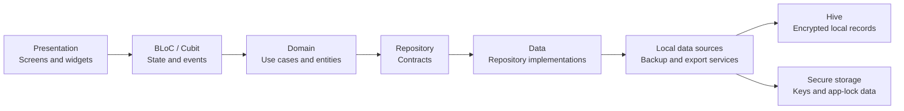

<div align="center">


# Masrofy

### Privacy-first personal finance tracking with Flutter

Masrofy helps users record daily income and expenses, organize wallets and
budgets, review financial reports, and keep recoverable local backups—without
requiring an account or sending financial data to a remote backend.


</div>

## Overview

Masrofy is a local-first expense tracker designed around practical daily money
management. It combines a responsive Arabic and English interface with
structured financial workflows, privacy-aware storage, reporting, export, and
recovery features.

The project demonstrates how a feature-rich Flutter application can keep its
presentation, business rules, and persistence concerns clearly separated while
remaining testable and maintainable.

## Key Features

- Record, edit, filter, and delete income and expense transactions
- Organize transactions with built-in and custom categories
- Track balances across multiple wallet types
- Create monthly category budgets and monitor their progress
- Review daily, weekly, monthly, and custom-period reports
- Visualize spending with charts, trends, and category breakdowns
- Export financial data to Excel and reports to PDF
- Create, validate, merge, replace, and restore local backups
- Protect access with a PIN and supported biometric authentication
- Hide sensitive financial values using privacy controls
- Use Arabic and English interfaces with RTL support
- Adapt layouts across compact and wider screens

## Privacy by Design

Masrofy does not require a backend account. Its core financial records remain
on the user's device.

- No Firebase or cloud database
- No remote authentication
- No advertising or subscription SDKs
- No third-party analytics
- No embedded API keys or environment secrets
- Protected storage for encryption and app-lock key material
- Salted PIN verification and lockout behavior
- Versioned backup validation with rollback on failed restores

The project still depends on platform security and correct release signing.
Never commit real keystores, signing passwords, or local signing configuration.

## Technology Stack

| Area | Technologies |
| --- | --- |
| Application | Flutter, Dart, Material 3 |
| State management | BLoC, Cubit, Equatable |
| Architecture | Layered architecture, repository pattern, dependency injection |
| Navigation | `go_router` |
| Dependency injection | `get_it` |
| Local data | Hive, `hive_flutter`, `path_provider` |
| Security | `flutter_secure_storage`, `local_auth`, `crypto` |
| Reports and export | `fl_chart`, `excel`, `pdf`, `printing` |
| Models and generation | Freezed, JSON serialization, Build Runner |
| Localization | Flutter localization generation, `intl`, Arabic RTL |
| Testing | Flutter Test, BLoC Test, Mockito, Checks, Integration Test |

## Architecture

Masrofy follows a layered dependency flow. Presentation code depends on
application-facing abstractions rather than storage implementations.



### Project Structure

```text
lib/
├── app/            # Application startup, theme, and root composition
├── core/           # Shared security, storage, migration, and utility code
├── data/           # Models, local data sources, repositories, backup, export
├── di/             # Dependency registration
├── domain/         # Entities, repository contracts, and use cases
├── l10n/           # Localization resources and generated delegates
├── presentation/   # Cubits, screens, reusable widgets, and UI models
└── routing/        # Application routes and navigation configuration
```

## Reliability and Testing

The repository includes 42 unit and widget test files plus an integration test
covering the onboarding flow.

The latest documentation review verified 119 passing non-integration tests
across:

- Financial calculations and filtering
- Transaction, budget, category, and wallet use cases
- Repository and local data-source behavior
- Storage migration and encryption handling
- Backup validation, rollback, merge, and restore behavior
- PIN, biometric, and privacy-lock behavior
- Cubit state transitions and failure mapping
- Dashboard, reports, budgets, history, onboarding, and settings widgets
- Dependency initialization and startup failure handling

Static analysis completes without warnings or errors under the documented
toolchain. The
[Flutter Quality Checks](https://github.com/Khaled-shahien/masrofy_app/actions/workflows/flutter-quality.yml)
workflow runs analysis and all non-integration tests for changes targeting
`main`.

## Getting Started

### Requirements

- Flutter compatible with Dart `^3.12.0-113.2.beta`
- Android Studio or Xcode for mobile development
- An emulator, simulator, or physical device

Verify the active toolchain:

```sh
flutter --version
flutter doctor
```

### Installation

```sh
git clone https://github.com/Khaled-shahien/masrofy_app.git
cd masrofy_app
flutter pub get
flutter gen-l10n
dart run build_runner build --delete-conflicting-outputs
flutter run
```

The repository includes generated model and localization files. Regenerate them
after changing Freezed models, JSON mappings, or localization resources.

## Validation Commands

```sh
flutter analyze --no-pub
flutter test --no-pub
flutter build apk --debug --no-pub
```

Run the integration flow on a compatible target:

```sh
flutter test integration_test
```

## Android Release Signing

The repository includes `android/key.properties.example` with placeholders.
Create a local `android/key.properties` file for release signing and keep all
real values outside version control.

Expected settings:

```properties
storeFile=<path-to-your-keystore>
storePassword=<your-store-password>
keyAlias=<your-key-alias>
keyPassword=<your-key-password>
```

The real properties file and common keystore extensions are already excluded
by `.gitignore`.

## Product Screenshots

Screenshots will be added from anonymized demo data. The planned visual set
covers onboarding, the dashboard, transaction entry, budgets, reports, and
privacy or backup controls.

## Engineering Challenges

- Preserving valid financial records during versioned storage migrations
- Rolling back safely when a restore operation fails midway
- Keeping category, wallet, budget, and transaction rules in the domain layer
- Protecting encryption and app-lock material without storing a PIN in plain text
- Supporting both Arabic RTL and English layouts across screen sizes
- Generating Excel and PDF output without exposing sensitive filenames
- Coordinating multiple reactive data streams in reports and balance summaries

## Current Status and Roadmap

Masrofy is an actively improved portfolio project. Current priorities include:

- Add anonymized screenshots and a short product walkthrough
- Extend CI with formatting and Android build verification
- Expand device-backed integration coverage
- Continue extracting large screens into smaller reusable components
- Review dependency updates in isolated, tested groups
- Complete production release and store-readiness checks

No public store release, APK, or hosted demo is claimed at this time.

## License

No open-source license is currently included. The source is public for
portfolio review; reuse or redistribution rights are not granted unless a
license is added later.

## Contact

For Flutter roles, project collaboration, or code-review enquiries:

- [GitHub](https://github.com/Khaled-shahien)
- [LinkedIn](https://www.linkedin.com/in/khaled-shahien-18803a1a5/)
